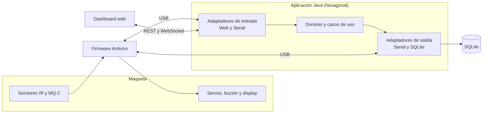

# Smart Parking Lot

Sistema de gestión automatizada de un parqueadero, construido como maqueta a escala instrumentada con Arduino y controlada por una aplicación en Java bajo arquitectura hexagonal.


---

## Descripción

Smart Parking Lot controla el acceso vehicular de forma automática, mantiene el conteo de cupos disponibles en tiempo real y vigila condiciones de riesgo por humo o gas, activando una alarma cuando se supera un umbral configurable.

El proyecto integra un sistema físico de sensado y control (sensores y actuadores sobre Arduino) con un software diseñado bajo principios SOLID y GRASP y patrones de diseño. Toda la operación y el monitoreo se hacen desde un panel web en tiempo real, y cada evento (entradas, salidas y alertas de seguridad) queda registrado de forma persistente.

## Características

- Detección automática de vehículos en los puntos de entrada y salida.
- Control automático de barreras con lógica de apertura y cierre seguro.
- Conteo de cupos en tiempo real, único, consistente y persistente.
- Monitoreo continuo de humo o gas, con alarma sonora y protocolo de emergencia.
- Panel web de control y monitoreo con actualización en vivo mediante WebSocket.
- Registro histórico de accesos y de eventos de seguridad.
- Capacidad y umbral configurables sin recompilar el sistema.

## Arquitectura

El sistema sigue una arquitectura hexagonal (puertos y adaptadores). El dominio y los casos de uso no dependen del hardware ni de la base de datos: se comunican con el exterior a través de puertos, y los adaptadores implementan esos puertos con tecnología concreta. Así, la lógica de negocio se puede probar sin hardware, y la comunicación serial, la persistencia o la interfaz se pueden sustituir sin tocar el núcleo.



La descripción completa está en [docs/plan_tecnico.md](docs/plan_tecnico.md) y [docs/arquitectura.md](docs/arquitectura.md).

## Stack tecnológico

| Capa | Tecnología |
|---|---|
| Software de control | Java 17, Maven |
| Arquitectura | Hexagonal (puertos y adaptadores) |
| Comunicación con Arduino | jSerialComm (protocolo serial de texto) |
| Persistencia | SQLite con JDBC |
| Servidor web y tiempo real | Javalin (REST y WebSocket) |
| Frontend | HTML, CSS y JavaScript con Chart.js |
| Firmware | C++ sobre Arduino Uno |
| Pruebas | JUnit 5 y Mockito |

## Estructura del repositorio

```
smart-parking-lot/
├── docs/            Documentacion tecnica (plan, arquitectura, protocolo, base de datos)
├── firmware/        Codigo del Arduino (C++)
├── hardware/        Lista de materiales y diagramas de conexion
└── host/            Aplicacion de control en Java (proyecto Maven)
    └── src/
        ├── main/java/com/unillanos/smartparking/
        │   ├── domain/          Entidades, estados, politicas, eventos y puertos
        │   ├── application/     Casos de uso y comandos
        │   ├── infrastructure/  Adaptadores: serial, persistencia, configuracion
        │   └── interfaces/      Adaptador web (Javalin) y dashboard
        └── test/                Pruebas del nucleo
```

## Requisitos previos

- JDK 17 o superior
- Maven 3.9 o superior
- Arduino IDE o PlatformIO para el firmware
- Una placa Arduino Uno con los sensores y actuadores descritos en [hardware/README.md](hardware/README.md)

## Compilación y ejecución

Desde la carpeta `host/`:

```bash
mvn clean package
java -jar target/smart-parking-lot.jar
```

El panel de control queda disponible en `http://localhost:7070` (puerto configurable).

> El proyecto está en desarrollo. Las partes de software se completan según el plan de trabajo descrito en la documentación.

## Hardware

El resumen del montaje, la lista de materiales y la asignación de pines están en [hardware/README.md](hardware/README.md). El firmware y el protocolo de comunicación con el host se documentan en [firmware/README.md](firmware/README.md) y [docs/protocolo_serial.md](docs/protocolo_serial.md).

## Documentación

- [Plan técnico completo](docs/plan_tecnico.md)
- [Arquitectura](docs/arquitectura.md)
- [Protocolo de comunicación serial](docs/protocolo_serial.md)
- [Base de datos](docs/base_de_datos.md)

## Equipo

| Integrante | Código |
|---|---|
| Luis Miguel Bahamón González | 160005101 |
| Emerson Andrey Beltrán Álvarez | 160005103 |
| Juan Fernando Fernández Vega | 160005112 |
| Mario Alejandro Rey Reina | 160004833 |
| César Mauricio Pérez Santos | 160005130 |

Universidad de los Llanos — Ingeniería de Sistemas — Tecnologías Avanzadas.

## Licencia

Distribuido bajo la licencia MIT. Ver el archivo [LICENSE](LICENSE).
