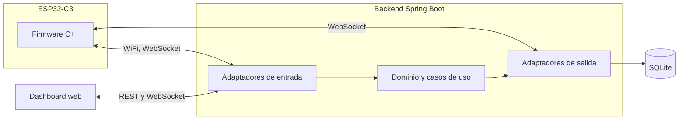

# Smart Parking Lot

Sistema de gestión automatizada de un parqueadero, construido como maqueta a escala. Un dispositivo ESP32-C3 con sensores y actuadores controla el acceso, y un backend en Java con arquitectura hexagonal mantiene el conteo, la seguridad y el historial, con un panel web en tiempo real.


## Descripción

El sistema controla el acceso vehicular de forma automática, mantiene el conteo de cupos disponibles en tiempo real y vigila la presencia de humo o gas, activando una alarma cuando se supera un umbral configurable. La ESP32-C3 se comunica con el backend por WiFi mediante WebSocket; el backend concentra toda la lógica de negocio y sirve un panel web de control y monitoreo. Cada acceso y cada alerta quedan registrados de forma persistente.

## Características

- Detección automática de vehículos en entrada y salida.
- Control automático de barreras con cierre seguro.
- Conteo de cupos en tiempo real, único y persistente.
- Monitoreo continuo de humo con alarma y protocolo de emergencia.
- Panel web de control y monitoreo con actualización en vivo.
- Registro histórico de accesos y de eventos de seguridad.
- Capacidad y umbral configurables sin recompilar.

## Arquitectura

Arquitectura hexagonal (puertos y adaptadores). El dominio y la aplicación no dependen de Spring ni de la base de datos ni del dispositivo: se comunican con el exterior a través de puertos, y los adaptadores implementan esos puertos con tecnología concreta. La lógica de negocio reside en el backend; la ESP32 solo detecta, ejecuta y muestra.



## Stack tecnológico

| Capa | Tecnología |
|---|---|
| Backend | Java 17, Spring Boot 3, Maven |
| Tiempo real y enlace con el dispositivo | Spring WebSocket |
| Persistencia | Spring Data JPA sobre SQLite |
| Frontend | HTML, CSS y JavaScript con Chart.js |
| Dispositivo | ESP32-C3 Super Mini (WiFi) |
| Firmware | C++ con el núcleo Arduino de ESP32 |

## Estructura del repositorio

```
smart-parking-lot/
├── docs/            Documentacion tecnica
├── firmware/        Firmware de la ESP32-C3 (C++)
├── hardware/        Lista de materiales y diagramas de conexion
└── host/            Backend en Java (proyecto Maven Spring Boot)
```

## Requisitos previos

- JDK 17 o superior
- Maven 3.9 o superior
- IDE de Arduino con soporte para ESP32 (o PlatformIO)
- Una ESP32-C3 con los sensores y actuadores descritos en `hardware/`

## Compilación y ejecución

Desde `host/`:

```bash
mvn clean package
java -jar target/smart-parking-lot.jar
```

El panel queda disponible en `http://localhost:7070`. La ESP32 debe estar en la misma red WiFi y apuntar a la IP del backend.

## Equipo

| Integrante | Código |
|---|---|
| Luis Miguel Bahamón González | 160005101 |
| Emerson Andrey Beltrán Álvarez | 160005103 |
| Juan Fernando Fernández Vega | 160005112 |
| Mario Alejandro Rey Reina | 160004833 |
| César Mauricio Pérez Santos | 160005130 |

Universidad de los Llanos — Ingeniería de Sistemas — Tecnologías Avanzadas.

## Licencia

Distribuido bajo la licencia MIT. Ver el archivo `LICENSE`.
