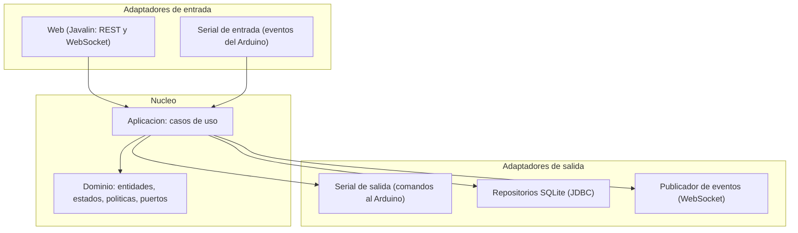

# Arquitectura

Documento de referencia de la arquitectura del sistema. El detalle completo (requisitos, hardware, plan de trabajo) está en [plan_tecnico.md](plan_tecnico.md).

## Estilo

Arquitectura hexagonal (puertos y adaptadores). El dominio y los casos de uso son el centro y no conocen la tecnología concreta. Se comunican con el exterior a través de puertos (interfaces), y los adaptadores implementan esos puertos.

Regla de dependencias: las dependencias apuntan hacia adentro. La infraestructura depende del dominio; el dominio no depende de nadie. Esto materializa el Principio de Inversión de Dependencias.

## Componentes

## Capas y responsabilidades

- Dominio: reglas del negocio puras. Entidades (ParkingLot, Spot, Visit, SecurityEvent), objetos de valor, eventos, máquinas de estado y políticas. Define los puertos que necesita del exterior. No importa librerías de infraestructura.
- Aplicación: orquesta los casos de uso (registrar ingreso, registrar salida, procesar humo, ejecutar emergencia, cambiar configuración). Coordina el dominio con los puertos de salida.
- Infraestructura: implementaciones concretas de los puertos de salida (adaptador serial con jSerialComm, repositorios SQLite, configuración, logging).
- Interfaces: adaptadores de entrada, es decir la web (Javalin) y el lector serial que traduce mensajes del Arduino en llamadas a casos de uso.

## Puertos

Puertos de entrada (lo que el sistema ofrece):

- RegisterEntryUseCase
- RegisterExitUseCase
- ProcessSmokeReadingUseCase
- RunEmergencyProtocolUseCase
- UpdateConfigurationUseCase
- QueryStatusUseCase
- QueryHistoryUseCase

Puertos de salida (lo que el sistema necesita del exterior):

- ArduinoGatewayPort
- VisitRepositoryPort
- SecurityEventRepositoryPort
- ConfigurationRepositoryPort
- EventPublisherPort

## Patrones de diseño

| Patrón | Dónde | Problema que resuelve |
|---|---|---|
| Adapter | SerialArduinoGateway sobre jSerialComm | Aislar la tecnología serial detrás de una interfaz del dominio. |
| Repository | VisitRepository, SecurityEventRepository, ConfigurationRepository | Abstraer el acceso a datos y permitir pruebas en memoria. |
| State | Estado de la barrera y estado del sistema | Eliminar condicionales dispersos; cada estado gobierna sus transiciones. |
| Observer | Publicación de eventos hacia el dashboard | Desacoplar quién genera un evento de quién reacciona. |
| Command | Acciones de control (abrir, cerrar, alarmar, emergencia) | Encapsular acciones como objetos reutilizables. |
| Strategy | Política de acceso | Cambiar la regla de autorización sin tocar el caso de uso. |
| Facade | Servicios de aplicación | Ofrecer una entrada única y limpia hacia el núcleo. |
| Factory Method | Creación de estados y comandos | Centralizar la construcción de objetos. |

Sobre Singleton: se evita el Singleton clásico (instancia estática global). Los recursos únicos (conexión serial, conexión a la base de datos, configuración) se crean una vez en el composition root y se inyectan por constructor. Se logra una sola instancia sin acoplamiento oculto y sin dificultar las pruebas.

## Principios SOLID

- S: cada caso de uso y cada adaptador tienen una responsabilidad única.
- O: nuevas políticas o adaptadores no obligan a modificar el núcleo.
- L: cualquier implementación de un puerto (real o de prueba) es intercambiable.
- I: puertos pequeños y específicos en lugar de una interfaz general.
- D: el dominio depende de abstracciones; las implementaciones dependen del dominio.

## Ubicación de la lógica

Toda la lógica de negocio (conteo, autorización, protocolo de emergencia) reside en el host. El firmware solo detecta, ejecuta y muestra. Esto garantiza consistencia y persistencia del conteo. El firmware mantiene únicamente un modo seguro local para cuando pierde comunicación con el host.
