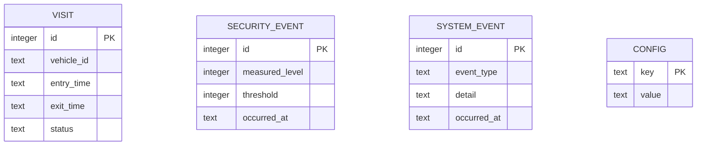

# Base de datos

Persistencia en SQLite, en un archivo local. El acceso va detrás del patrón Repository. Las fechas se guardan en formato ISO-8601 (texto). El script de creación está en [host/src/main/resources/db/schema.sql](../host/src/main/resources/db/schema.sql).

## Modelo

## Tablas

- `config`: parámetros del sistema en pares clave-valor. Incluye `total_capacity`, `smoke_threshold` y `system_state`. Permite ajustar capacidad y umbral sin recompilar.
- `visit`: cada visita (entrada y salida). Estado `ACTIVE` mientras el vehículo está dentro y `FINISHED` cuando sale. El identificador de vehículo es opcional.
- `security_event`: cada alerta de humo o gas, con el nivel medido, el umbral vigente y la marca de tiempo.
- `system_event`: bitácora de cambios de estado del sistema (cambios de estado operativo, inicio y fin de emergencia).

## Recuperación tras reinicio

Al iniciar, la aplicación:

1. Lee la capacidad y el umbral desde `config`.
2. Cuenta las visitas con estado `ACTIVE` para reconstruir los cupos ocupados.
3. Calcula los cupos disponibles como capacidad menos visitas activas.
4. Restablece el estado operativo.

Así el conteo y el estado sobreviven a un corte de energía sin perder la información acumulada.
