# Especificación técnica — Smart Parking Lot

Documento de construcción del proyecto. Reemplaza a las versiones anteriores. Está escrito para servir de plano de implementación: describe el stack, la arquitectura, todas las clases y sus responsabilidades, los contratos, los diagramas y las convenciones, con el detalle suficiente para implementarlo directamente a partir de él.

**Curso:** Tecnologías Avanzadas — Universidad de los Llanos
**Equipo:** Luis Miguel Bahamón González, Emerson Andrey Beltrán Álvarez, Juan Fernando Fernández Vega, Mario Alejandro Rey Reina, César Mauricio Pérez Santos.
**Landmark de la maqueta:** por definir (no afecta el software).

---

## Tabla de contenido

1. Objetivo y alcance
2. Stack tecnológico
3. Topología y arquitectura
4. Estructura de paquetes y carpetas
5. Modelo
6. Máquinas de estado
7. Política de acceso
8. Notificaciones al tablero
9. Capa de repositorio
10. Enlace con el dispositivo desde la capa de servicio
11. Capa de servicio
12. Comandos
13. Enlace con el dispositivo y arranque
14. Capa web
15. Frontend
16. Patrones de diseño aplicados
17. Protocolo del enlace con el dispositivo
18. Firmware de la ESP32-C3
19. Hardware y montaje
20. Base de datos
21. Configuración
22. Dependencias
23. Estrategia de pruebas
24. Requisitos
25. Trazabilidad requisitos a diseño
26. Diagramas UML
27. Instrucciones de implementación
28. Compilación y ejecución
29. Limitaciones conocidas y riesgos aceptados
30. Anexo: README del repositorio

---

## 1. Objetivo y alcance

Maqueta a escala de un parqueadero inteligente. Un dispositivo con sensores y actuadores controla el acceso vehicular de forma automática, y un backend mantiene el conteo de cupos en tiempo real y vigila humo o gas, activando una alarma cuando se supera un umbral configurable. La operación y el monitoreo se hacen desde un panel web en tiempo real, y la actividad queda registrada de forma persistente.

Dentro del alcance: detección de vehículos, control de barreras, conteo de cupos, registro histórico, monitoreo de humo con alarma y protocolo de emergencia, panel web de control y monitoreo, persistencia.

Fuera del alcance: cobro por estadía, reserva de cupos, asignación de plazas individuales, reconocimiento automático de placas.

## 2. Stack tecnológico

| Componente | Elección |
|---|---|
| Lenguaje del backend | Java 25 |
| Framework | Spring Boot 4.1.x |
| Construcción | Maven |
| Web y REST | Spring WebMVC |
| Tiempo real y enlace con el dispositivo | Spring WebSocket |
| Validación | Spring Validation |
| Persistencia | Spring Data JPA sobre SQLite |
| Driver de base de datos | org.xerial:sqlite-jdbc |
| Dialecto Hibernate para SQLite | org.hibernate.orm:hibernate-community-dialects |
| Serialización JSON | Jackson 3 (paquetes `tools.jackson`) |
| Frontend | HTML, CSS y JavaScript, con Chart.js |
| Placa | ESP32-C3 Super Mini (WiFi y Bluetooth, lógica de 3.3V) |
| Firmware | C++ con el núcleo Arduino de ESP32 |
| Enlace ESP32 a backend | WebSocket sobre WiFi, mensajes JSON |
| Pruebas | JUnit 5, Mockito y los starters de prueba de Spring Boot |

Spring Boot 4 renombró algunos artefactos respecto a la serie 3: el starter web
es `spring-boot-starter-webmvc` y cada módulo trae su propio starter de prueba
(`spring-boot-starter-webmvc-test`, `spring-boot-starter-data-jpa-test`, entre
otros). Jackson pasó a la versión 3, cuyos paquetes son `tools.jackson` en lugar
de `com.fasterxml.jackson`.

## 3. Topología y arquitectura

### 3.1 Topología física

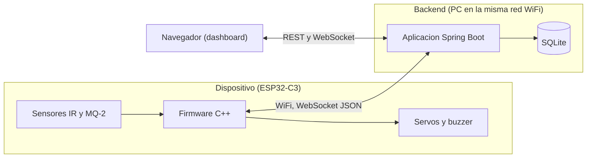

La ESP32-C3 y el backend están en la misma red WiFi. La ESP32 abre una conexión WebSocket hacia el backend (la ESP32 es el cliente y el backend el servidor). Por esa conexión la ESP32 envía eventos y telemetría, y el backend envía comandos. El dashboard se sirve desde el mismo backend y se abre en un navegador de la red.

### 3.2 Arquitectura de software

Arquitectura en capas.

Regla principal: el sistema se organiza en capas horizontales y cada una solo
conoce a la que tiene debajo. La capa web recibe la petición y delega en la de
servicio; la de servicio aplica las reglas de negocio y pide datos a la de
repositorio; la de repositorio habla con la base. Ninguna capa salta sobre otra
ni llama hacia arriba.

| Capa | Paquete | Responsabilidad |
|---|---|---|
| Presentación | `controller`, `dto`, `websocket`, `security` | Recibe peticiones REST y conexiones WebSocket, valida la entrada y traduce entre DTOs y entidades. |
| Negocio | `service` | Reglas del parqueadero: conteo, autorización de ingreso, emergencia, autenticación. Es la única capa que decide. |
| Persistencia | `repository` | Acceso a datos con Spring Data JPA. |
| Modelo | `model` | Entidades JPA y enumeraciones, compartidas por las demás capas. |
| Configuración | `config`, `exception` | Beans, arranque del sistema y traducción de errores a HTTP. |

A diferencia de la arquitectura hexagonal, aquí no hay puertos ni adaptadores:
los servicios dependen directamente de los repositorios de Spring Data y las
entidades JPA hacen las veces de modelo, sin una capa de mapeo intermedia. El
modelo queda acoplado a JPA, y a cambio se elimina la duplicación entre
entidades de dominio y entidades de persistencia.

Autoridad de la lógica: toda la lógica de negocio (conteo, autorización,
protocolo de emergencia) reside en el backend. El firmware solo detecta,
ejecuta y muestra, y mantiene un modo seguro local para cuando pierde la
conexión.


## 3.3 Concurrencia y consistencia

Los mensajes del dispositivo y las peticiones del dashboard pueden llegar en hilos distintos. El `EstadoParqueaderoService` guarda el conteo en memoria y es estado mutable compartido, así que dos eventos simultáneos podrían leer el mismo valor de cupos y descontar dos veces, dejando el conteo inconsistente. Además, SQLite bloquea el archivo completo al escribir, y dos escrituras a la vez (un ingreso y una telemetría de humo) fallarían por base bloqueada.

Regla obligatoria: los eventos que cambian el estado o escriben en la base se procesan en serie, con `EjecutorEventos`, un ejecutor de un solo hilo de la capa de servicio. Con esto no hay mutación concurrente del conteo ni escrituras simultáneas a SQLite. Como complemento, el pool de conexiones se fija en tamaño 1 y se habilita el modo WAL (sección 21).

Modelo de conteo con reserva: al autorizar un ingreso se reserva el cupo de inmediato (se descuenta), para que un segundo vehículo no sea admitido al último lugar. La reserva se confirma cuando llega `PASO_COMPLETADO`. Si vence el tiempo de espera sin paso y el sensor quedó libre, la reserva se revierte (se devuelve el cupo). En la salida no hay reserva: el cupo se suma al confirmarse el paso.

Transacciones: las transacciones gobiernan la base de datos, no el conteo en memoria. El orden es persistir primero y mutar el conteo solo si el guardado tuvo éxito, o compensar si falla. La anotación `@Transactional` va en los métodos de la capa de servicio, que es donde empieza y termina cada operación de negocio.

## 4. Estructura de paquetes y carpetas

```
com.tecno.Smartparking
├── SmartparkingApplication.java      Clase de arranque (@SpringBootApplication)
├── model                             Entidades JPA, enumeraciones y conversores
├── repository                        Interfaces de Spring Data
├── service                           Reglas de negocio
│   ├── barrera                       Barrera y sus estados (patron State)
│   ├── politica                      PoliticaAcceso y su estrategia por defecto
│   └── comando                       Comando, comandos concretos, fabrica e invocador
├── controller                        Controladores REST
├── dto                               Objetos de transferencia
├── websocket                         Enlace con la ESP32 y tablero de los navegadores
├── security                          Sesion del operador e interceptor de permisos
├── config                            Beans, WebSocket, interceptores e inicializadores
└── exception                         Error de negocio y manejo global de errores
```

Recursos en `src/main/resources`: `application.properties`, `db/schema.sql`,
`logback-spring.xml` y los archivos del tablero en `static/`. El firmware va en
una carpeta `firmware/` en la raíz del repositorio.


## 5. Modelo

Entidades JPA anotadas, que sirven a la vez de modelo de negocio y de mapeo a
la base. Identificadores en español sin tildes, salvo las clases del modelo de
autenticación, que conservan los nombres en inglés del diagrama de la
asignatura.


### 5.1 Enumeraciones

- `EstadoOperativo`: `OPERATIVO`, `LLENO`, `EMERGENCIA`.
- `TipoPunto`: `ENTRADA`, `SALIDA`.
- `TipoVehiculo`: `CARRO`, `TURBO`.
- `EstadoVisita`: `ACTIVO`, `FINALIZADO`.

### 5.2 Entidades del parqueadero

**RegistroAcceso** (`@Entity`, tabla `registro_acceso`). Equivale a una visita.

- Campos: `Long id`, `String placa` (opcional), `LocalDateTime horaEntrada`, `LocalDateTime horaSalida` (nula mientras está activa), `EstadoVisita estadoVisita`.
- Métodos: `void finalizar(LocalDateTime cuando)`, `boolean estaActivo()`, `Duration duracion()`.

**EventoSeguridad** (`@Entity`, tabla `evento_seguridad`).

- Campos: `Long id`, `int nivelGas`, `int umbral`, `LocalDateTime timestamp`, `int requiereEvacuacion` (0 o 1, expuesto como booleano).

**EventoSistema** (`@Entity`, tabla `evento_sistema`, bitácora).

- Campos: `Long id`, `String tipo`, `String detalle`, `LocalDateTime timestamp`.

**Vehiculo** (`@Entity`, tabla `vehiculo`, opcional). Solo se usa si se ingresa una placa manualmente desde el tablero.

- Campos: `String placa`, `TipoVehiculo tipoVehiculo`, `LocalDateTime fechaRegistro`.

**Parametro** (`@Entity`, tabla `configuracion`). Configuración como pares clave-valor: `capacidad_total`, `umbral_humo` y `estado_sistema`.

**ConvertidorFechaIso** (`@Converter(autoApply = true)`). Guarda todo `LocalDateTime` como texto ISO-8601 de ancho fijo. El ancho fijo importa: las consultas por rango comparan estas cadenas directamente en SQLite.

El conteo de cupos no es una entidad: vive en memoria dentro de
`EstadoParqueaderoService` y se reconstruye al arrancar contando las visitas
activas. No se modela una clase de cupo individual porque el alcance no lo
requiere.

Con solo sensores IR no se conoce la placa del vehículo. Por eso la placa es
opcional (RF-20). El emparejamiento de una salida con su entrada se hace por
orden de llegada: se cierra el registro activo más antiguo.

### 5.3 Modelo de autenticación y autorización

Control de acceso basado en roles (RBAC), tomado del modelo UML de la
asignatura. Sus clases conservan los nombres en inglés del diagrama original
para que la correspondencia entre el UML y el código sea directa.

**Permission** (`@Entity`, tabla `permiso`). Permiso sobre una acción, identificado por su código. Dos permisos con el mismo código son el mismo permiso.

- Códigos definidos: `BARRERA_CONTROL`, `EMERGENCIA_CONTROL`, `CONFIG_UPDATE`, `CUPOS_SYNC`.

**Role** (`@Entity`, tabla `rol`). Agrupa permisos mediante `rol_permiso`.

- Roles precargados: `ADMIN` (todos los permisos), `OPERADOR` (barreras, emergencia y recalibración) y `CONSULTA` (solo lectura).

**Credential** (`@Embeddable`). El usuario la posee por composición.

- Campos: `String passwordHash`, `String salt`, `LocalDateTime lastChangedAt`.

**User** (`@Entity`, tabla `usuario`). Se asocia a roles mediante `usuario_rol`.

- Campos: `String id` (UUID), `String username`, `String email`, `int activo`, `LocalDateTime createdAt`, `Credential credential`, `Set<Role> roles`.
- Métodos: `boolean isActive()`, `void activate()`, `void deactivate()`, `void addRole(Role)`.

Las contraseñas nunca se guardan en claro: se almacenan como SHA-256 sobre una
sal aleatoria por usuario, y la verificación compara en tiempo constante.


## 6. Máquinas de estado

### 6.1 Barrera (patrón State)

- `Barrera`: campos `TipoPunto punto`, `EstadoBarrera estado`. Métodos: `autorizar()`, `marcarAbierta()`, `marcarVehiculoPaso()`, `marcarCerrada()`, `marcarVehiculoPresente()`, `marcarTiempoDeEspera()`. Cada método delega en el estado actual, que decide la transición.
- `EstadoBarrera` (interfaz): declara los eventos de transición.
- Estados concretos: `EstadoCerrada`, `EstadoAbriendo`, `EstadoAbierta`, `EstadoCerrando`.

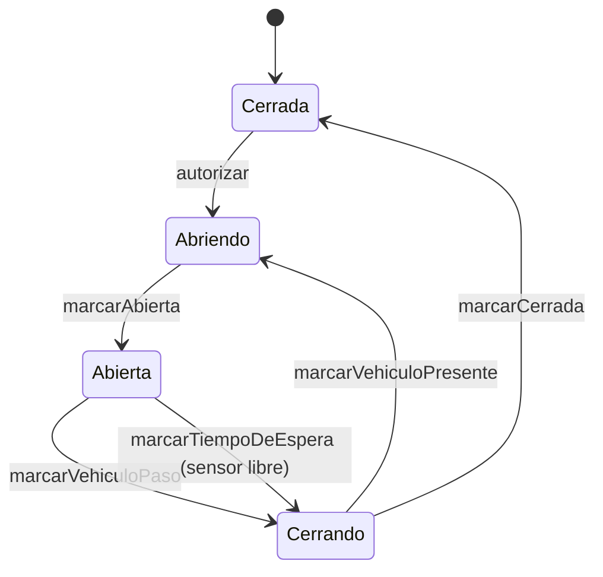

La transición de Cerrando a Abriendo cuando el sensor sigue detectando presencia implementa la condición segura: no cerrar en caso de duda. La actuación física (mover el servo) la ordena la capa de servicio a través de `DispositivoService` cuando una transición implica abrir o cerrar; el estado en sí no toca el hardware.

Tiempo de espera (vehículo fantasma): al abrir una barrera, el backend programa un tiempo de espera. Si vence sin `PASO_COMPLETADO`, hay dos casos. Si el sensor quedó libre, el vehículo no cruzó (se devolvió o fue un falso positivo): se cierra la barrera y se revierte la reserva del cupo. Si el sensor sigue ocupado, hay un vehículo detenido en el punto: la barrera no se cierra, se mantiene abierta y se avisa al operador. Nunca se cierra la barrera sobre un sensor ocupado (RNF-09).

### 6.2 Estado del sistema

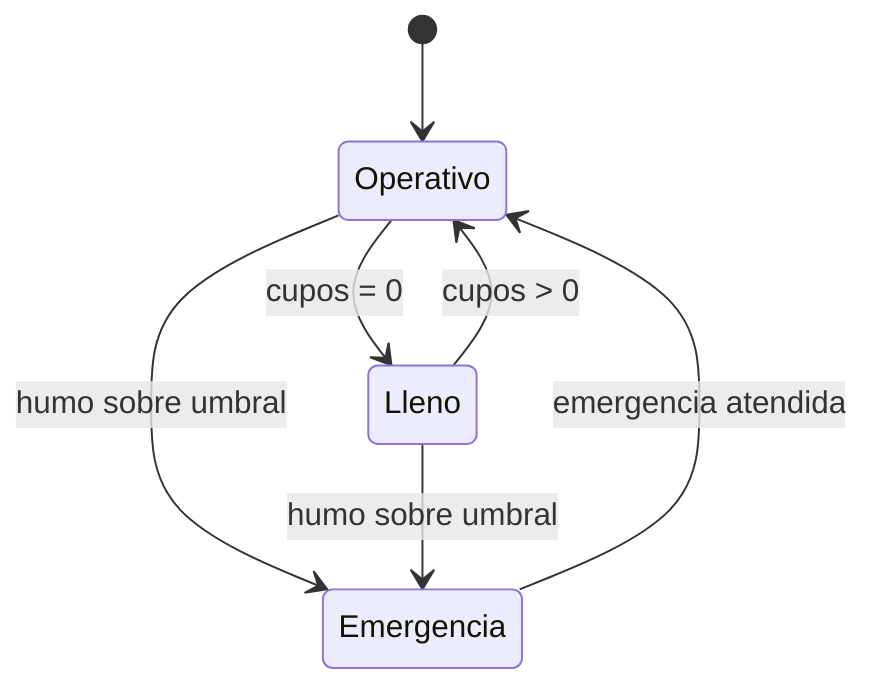

En Lleno se bloquea la apertura de la entrada; la salida sigue disponible. En Emergencia se ejecuta el protocolo: habilitar salida, bloquear ingresos y sostener la alarma.

## 7. Política de acceso (patrón Strategy)

- `PoliticaAcceso` (interfaz): `boolean admiteIngreso(EstadoParqueadero estado)`.
- `PoliticaAccesoPorDefecto`: permite el ingreso si `cuposDisponibles > 0` y el estado es `OPERATIVO`.

Se declara como bean en `ConfiguracionBeans`. Cambiar la regla solo implica una nueva implementación, sin tocar los casos de uso.

## 8. Notificaciones al tablero

`NotificacionService` difunde cada cambio hacia los navegadores conectados. Cada
mensaje es un sobre JSON con el tipo, el momento en que ocurrió y sus datos:

```json
{"tipo":"CUPOS_CAMBIADOS","ocurridoEn":"2026-03-01T08:15:00","datos":{"cuposDisponibles":5,"capacidadTotal":6}}
```

| Tipo | Cuándo se envía |
|---|---|
| `CUPOS_CAMBIADOS` | El conteo de cupos cambió. |
| `ESTADO_SISTEMA_CAMBIADO` | El sistema pasó a OPERATIVO, LLENO o EMERGENCIA. |
| `ALARMA_CAMBIADA` | La alarma empezó o dejó de sonar. |
| `VEHICULO_INGRESADO` | Se autorizó y registró un ingreso. |
| `VEHICULO_EGRESADO` | Se cerró una visita por salida. |
| `UMBRAL_HUMO_SUPERADO` | Una lectura superó el umbral configurado. |
| `BARRERA_BLOQUEADA` | Hay un vehículo detenido y la barrera no pudo cerrar. |
| `DISPOSITIVO_CONEXION` | La ESP32 se conectó o se desconectó. |


## 9. Capa de repositorio

Interfaces de Spring Data en `repository`. Los servicios las usan directamente,
sin una capa de puertos intermedia. Spring genera la implementación en tiempo
de ejecución a partir del nombre de cada método o de la consulta declarada.

| Repositorio | Métodos propios |
|---|---|
| `RegistroAccesoRepository` | `countByEstadoVisita`, `findFirstByEstadoVisitaOrderByHoraEntradaAsc` (empareja la salida con su ingreso) y `buscarConFiltro` con rango de fechas y estado. |
| `EventoSeguridadRepository` | `buscarConFiltro` con rango de fechas. |
| `EventoSistemaRepository` | Solo los heredados de `JpaRepository`. |
| `ParametroRepository` | Solo los heredados; la configuración se guarda como pares clave-valor. |
| `VehiculoRepository` | Solo los heredados; el vehículo es opcional. |
| `UserRepository` | `findByUsernameOrEmail`, para entrar con nombre de usuario o correo. |
| `RoleRepository` | Solo los heredados. |

Las consultas con filtro reciben un `Pageable` para acotar el número de filas
devueltas, de modo que el historial no crezca sin límite en la respuesta.

## 10. Enlace con el dispositivo desde la capa de servicio

`DispositivoService` concentra la salida hacia la ESP32. Recibe la sesión
WebSocket abierta y el codificador de mensajes, y expone las acciones en
términos del negocio, no del protocolo:

```java
void abrirBarrera(TipoPunto punto);
void cerrarBarrera(TipoPunto punto);
void activarAlarma();
void silenciarAlarma();
void actualizarPantalla(int cuposDisponibles);
void configurarUmbral(int umbral);
boolean estaConectado();
```

Los demás servicios nunca construyen JSON: piden la acción y `DispositivoService`
la traduce al mensaje del protocolo de la sección 17.


## 11. Capa de servicio

Clases anotadas con `@Service` que reciben sus dependencias por constructor.
Son la única capa que decide: los controladores no contienen reglas y los
repositorios no conocen el negocio.

| Servicio | Responsabilidad |
|---|---|
| `EstadoParqueaderoService` | Conteo de cupos y estado operativo en memoria, con la invariante `0 <= cuposDisponibles <= capacidadTotal`. Única fuente de verdad. |
| `AccesoService` | Ingreso y salida. Al detectar entrada consulta la política; si admite, reserva el cupo, ordena abrir y guarda la visita. Al confirmar el paso cierra; si vence la espera, revierte la reserva. En la salida abre sin condicionar a cupos y empareja con el ingreso activo más antiguo. |
| `HumoService` | Compara la lectura con el umbral. Si lo supera, activa la alarma, registra el evento de seguridad y dispara la emergencia. |
| `EmergenciaService` | Habilita la salida, bloquea ingresos, sostiene la alarma, cambia el estado a EMERGENCIA y registra la bitácora. La limpieza restablece la operación. |
| `AlarmaService` | Enciende y silencia la alarma, y recuerda si está sonando. |
| `ConfiguracionService` | Capacidad, umbral y estado guardados como parámetros; propaga el umbral al dispositivo. |
| `HistorialService` | Consulta de registros y eventos de seguridad con filtros. |
| `ControlManualService` | Abre o cierra una barrera por orden del operador y atiende el reporte de barrera bloqueada. |
| `SincronizacionCuposService` | Recalibra el conteo y reconcilia los registros activos para que el valor sobreviva a un reinicio. |
| `DispositivoService` | Salida hacia la ESP32 (sección 10). |
| `NotificacionService` | Difunde cada cambio hacia el tablero por WebSocket. |
| `AuthenticationService` | Valida usuario o correo más contraseña y rechaza cuentas inactivas. |
| `AuthorizationService` | Resuelve los permisos efectivos de un usuario a través de sus roles. |
| `SimplePasswordHasher` | SHA-256 sobre sal, con sal aleatoria por usuario. |
| `EjecutorEventos` | Ejecutor de un solo hilo que serializa los eventos (sección 3.3). |

Los servicios que actúan sobre el hardware lo hacen mediante comandos
(sección 12), para centralizar el registro de las acciones.


## 12. Comandos (patrón Command)

Encapsulan las acciones sobre los actuadores como objetos. Un invocador único las ejecuta y registra.

```java
public interface Comando {
    void ejecutar();
}
```

Comandos concretos, cada uno con referencia a `DispositivoService` y sus parámetros: `ComandoAbrirBarrera`, `ComandoCerrarBarrera`, `ComandoActivarAlarma`, `ComandoSilenciarAlarma`, `ComandoActualizarPantalla`.

- `InvocadorComandos`: recibe un `Comando`, lo ejecuta y registra la acción en el log.

## 13. Enlace con el dispositivo y arranque

### 13.1 Enlace con la ESP32 (WebSocket)

- `DispositivoWebSocketHandler` (`@Component`, extiende `TextWebSocketHandler`): valida el token del handshake, guarda la sesión, decodifica cada mensaje entrante y lo despacha al servicio que corresponda a través del ejecutor de eventos.
- `SesionDispositivo` (`@Component`): guarda la sesión abierta y la marca del último latido. Se mantiene aparte del handler para que `DispositivoService` pueda escribir sin depender de él.
- `CodificadorMensajes` (`@Component`): convierte entre los mensajes del protocolo y JSON.
- `WebSocketConfig` (`@Configuration`, `@EnableWebSocket`): registra el handler del dispositivo en `/dispositivo` y el del tablero en `/tablero`.

Al perder la sesión con la ESP32, el backend registra el evento; la ESP32 entra
en su modo seguro por su cuenta.

Vigilancia de latidos (obligatoria): si la ESP32 pierde energía de golpe no
envía el cierre del WebSocket y la sesión queda huérfana en memoria.
`VigilanteLatidos` revisa con `@Scheduled` el último `LATIDO` recibido; si
supera el tiempo de tolerancia (`latido-timeout-ms`), cierra la sesión, marca el
dispositivo como desconectado y lo refleja en el tablero.

### 13.2 Persistencia

Las entidades JPA de la sección 5 se mapean a las tablas del esquema y los
repositorios de la sección 9 las leen y escriben. No hay mapeadores ni
adaptadores: la entidad que viaja por la capa de servicio es la misma que
Hibernate persiste.

Dos conversiones se declaran explícitamente para respetar el formato del
esquema: `ConvertidorFechaIso` guarda las fechas como texto ISO-8601 de ancho
fijo, y los booleanos se guardan como enteros en el campo correspondiente de la
entidad.

### 13.3 Configuración y arranque

- `BarrerasConfig` (`@Configuration`): declara las dos barreras como beans, porque son estado compartido y debe existir una sola instancia de cada una.
- `WebConfig` (`@Configuration`): registra el interceptor de autorización.
- `InicializadorSeguridad` (`ApplicationRunner`, orden 1): crea el usuario administrador la primera vez que arranca el sistema.
- `InicializadorEstado` (`ApplicationRunner`, orden 2): lee capacidad, umbral y estado guardados, cuenta los registros activos para reconstruir los cupos ocupados y fija el estado del parqueadero. Implementa la recuperación tras reinicio.


## 14. Capa web

### 14.1 Controladores REST

| Método y ruta | Controlador | Función | Acceso |
|---|---|---|---|
| `GET /api/estado` | `EstadoController` | Cupos, capacidad, estado, alarma y conexión del dispositivo. | Lectura |
| `GET /api/registros` | `HistorialController` | Historial de accesos, con filtros. | Lectura |
| `GET /api/eventos-seguridad` | `HistorialController` | Historial de eventos de seguridad. | Lectura |
| `GET /api/configuracion` | `ConfiguracionController` | Configuración actual. | Lectura |
| `POST /api/configuracion` | `ConfiguracionController` | Actualizar capacidad o umbral. | `CONFIG_UPDATE` |
| `POST /api/control/barrera` | `ControlController` | Abrir o cerrar una barrera. | `BARRERA_CONTROL` |
| `POST /api/control/emergencia` | `ControlController` | Forzar o limpiar la emergencia. | `EMERGENCIA_CONTROL` |
| `POST /api/control/sincronizar-cupos` | `ControlController` | Recalibrar el conteo de cupos ocupados. | `CUPOS_SYNC` |
| `POST /api/auth/login` | `AuthController` | Iniciar sesión con usuario o correo. | Abierto |
| `POST /api/auth/logout` | `AuthController` | Cerrar la sesión. | Abierto |
| `GET /api/auth/sesion` | `AuthController` | Sesión vigente con sus roles y permisos. | Abierto |

Los controladores dependen de los servicios y convierten entre DTOs y
entidades. No contienen reglas de negocio.

### 14.2 DTOs

En `dto`: `EstadoResponse`, `RegistroResponse`, `EventoSeguridadResponse`,
`ConfiguracionResponse`, `ConfiguracionRequest`, `BarreraRequest`,
`EmergenciaRequest`, `SincronizarCuposRequest`, `LoginRequest`,
`SesionResponse` y `ErrorResponse`. Las peticiones se validan con Spring
Validation.

### 14.3 WebSocket del tablero

- `TableroWebSocketHandler` (extiende `TextWebSocketHandler`): mantiene las sesiones de los navegadores y difunde mensajes JSON.
- `NotificacionService` construye cada mensaje y lo entrega al handler (sección 8).

Hay dos rutas WebSocket distintas: `/dispositivo` para la ESP32 y `/tablero`
para los navegadores.

### 14.4 Seguridad

El acceso al tablero usa el modelo de autenticación y autorización basado en
roles descrito en la sección 5.3.

- `AuthController` abre una sesión HTTP al validar las credenciales. La sesión se renueva en cada acceso para evitar fijación de sesión.
- `SesionOperador` guarda y recupera el usuario dentro de la sesión HTTP.
- `InterceptorAutorizacion` (`HandlerInterceptor`) mapea cada ruta de escritura a su permiso. Sin sesión responde 401; con sesión pero sin el permiso responde 403.
- `WebConfig` (`@Configuration`) registra el interceptor sobre `POST /api/configuracion` y `POST /api/control/**`.

Las rutas de lectura quedan abiertas en la red local. Es una protección
suficiente para el alcance; en producción se sumaría HTTPS y una gestión de
sesiones más estricta.

### 14.5 Manejo de errores

- `ManejadorGlobalErrores` (`@RestControllerAdvice`): traduce `NegocioException` a 400, los fallos de validación a 400 con el campo que falló, los recursos inexistentes a 404 y cualquier otro error a 500.


## 15. Frontend

Archivos estáticos servidos por Spring desde `src/main/resources/static`:

- `index.html`: panel con cupos disponibles en grande, capacidad, estado operativo y estado de alarma; controles de operador (abrir y cerrar barreras, forzar y limpiar emergencia, cambiar capacidad y umbral); tablas de historial de accesos y de eventos de seguridad; gráficos con Chart.js.
- `css/styles.css`: estilo sobrio, con énfasis en la legibilidad del número de cupos a distancia.
- `js/app.js`: cliente WebSocket a `/tablero` para actualización en vivo, llamadas REST para historial y configuración, y render de los gráficos.

El panel es el indicador visible de cupos por defecto (RF-13). Un display físico es opcional.

## 16. Patrones de diseño aplicados

| Patrón | Dónde | Problema que resuelve |
|---|---|---|
| Capas | Todo el backend | Separar presentación, negocio y datos, con dependencias en una sola dirección. |
| Repository | Interfaces de Spring Data en `repository` | Abstraer el acceso a datos y permitir consultas declarativas. |
| State | `Barrera` y sus estados | Gobernar transiciones sin condicionales dispersos. |
| Observer | `NotificacionService` sobre el WebSocket del tablero | Desacoplar quién genera un cambio de quién reacciona. |
| Command | Acciones sobre actuadores más `InvocadorComandos` | Encapsular acciones y centralizar su registro. |
| Strategy | `PoliticaAcceso` | Cambiar la regla de admisión sin tocar los servicios. |
| Facade | `DispositivoService` | Entrada única hacia el dispositivo, ocultando el protocolo JSON. |
| Factory Method | `FabricaEstadosBarrera` y `FabricaComandos` | Centralizar la construcción de objetos. |
| DTO | Paquete `dto` | Separar lo que viaja por HTTP de las entidades persistidas. |

Sobre Singleton: se evita el Singleton clásico. Los recursos únicos (fuente de
datos, sesión del dispositivo, barreras, conteo en memoria) existen como una
sola instancia porque el contenedor de Spring gestiona su ciclo de vida y los
inyecta. Se obtiene una sola instancia sin acoplamiento oculto y sin dificultar
las pruebas.


## 17. Protocolo del enlace con el dispositivo

Mensajes JSON sobre la conexión WebSocket entre la ESP32 y el backend. Es la frontera formal entre hardware y software. La ESP32 se conecta a `ws://<ip-del-backend>:7070/dispositivo` y se identifica con el token configurado.

Del dispositivo hacia el backend:

| Mensaje | Significado |
|---|---|
| `{"tipo":"LISTO"}` | El firmware terminó de iniciar y conectó. |
| `{"tipo":"ENTRADA_DETECTADA"}` | Vehículo presente en la entrada. |
| `{"tipo":"SALIDA_DETECTADA"}` | Vehículo presente en la salida. |
| `{"tipo":"PASO_COMPLETADO","punto":"ENTRADA"}` | El vehículo terminó de pasar (ENTRADA o SALIDA). |
| `{"tipo":"TELEMETRIA_HUMO","nivel":512}` | Lectura del sensor de humo (0 a 4095 en el ADC de la ESP32). |
| `{"tipo":"LATIDO"}` | Señal periódica de vida del firmware. |
| `{"tipo":"BARRERA_BLOQUEADA","punto":"ENTRADA"}` | La barrera no pudo cerrar porque el sensor sigue ocupado (vehículo detenido en el punto). |

Del backend hacia el dispositivo:

| Mensaje | Acción |
|---|---|
| `{"tipo":"ABRIR","punto":"ENTRADA"}` | Abrir la barrera (ENTRADA o SALIDA). |
| `{"tipo":"CERRAR","punto":"ENTRADA"}` | Cerrar la barrera. |
| `{"tipo":"ALARMA","estado":"ON"}` | Activar o silenciar la alarma (ON u OFF). |
| `{"tipo":"PANTALLA","cupos":5}` | Mostrar los cupos (solo si hay display). |
| `{"tipo":"CONFIG_UMBRAL","umbral":400}` | Fijar el umbral de humo en el firmware para el modo seguro. |
| `{"tipo":"PING"}` | Solicitar un latido inmediato. |

Reglas: el backend es la autoridad de negocio; el firmware solo detecta, ejecuta y muestra. El firmware confirma el fin del paso solo cuando el sensor queda liberado de forma estable, tras antirrebote. Si la conexión se cae por más del tiempo configurado, el firmware entra en modo seguro (entrada cerrada, salida permitida, alarma si detecta humo).

## 18. Firmware de la ESP32-C3

C++ con el núcleo Arduino de ESP32. Librerías: `WiFi` para la conexión, una librería de cliente WebSocket (por ejemplo arduinoWebSockets) y `ArduinoJson` para los mensajes.

### 18.1 Responsabilidades

- Conectarse a la red WiFi y mantener la conexión WebSocket con el backend.
- Leer los dos sensores IR con antirrebote, para no generar eventos duplicados.
- Leer el sensor MQ-2 por una entrada del ADC1 y enviarlo periódicamente como telemetría.
- Mover los servos de las barreras al recibir comandos.
- Encender o apagar el buzzer al recibir comandos.
- Enviar latidos periódicos y aplicar el modo seguro ante ausencia de backend.

### 18.2 Estructura del firmware

```
firmware/
├── smart_parking.ino        Configuracion, conexion WiFi y bucle principal
├── ClienteBackend.h/.cpp    Conexion WebSocket, envio de eventos y recepcion de comandos
├── SensorInfrarrojo.h/.cpp  Lectura IR con antirrebote
├── SensorHumo.h/.cpp        Lectura y suavizado del MQ-2
├── BarreraMotor.h/.cpp      Control de un servo (abrir y cerrar)
├── AlarmaSonora.h/.cpp      Control del buzzer
├── ControladorAccesoFisico.h/.cpp   Coordina los sensores y actuadores de acceso
└── GestorSeguridadFisica.h/.cpp     Coordina el sensor de humo, la alarma y el modo seguro
```

El firmware es no bloqueante: se apoya en `millis()` para el muestreo, los latidos y el antirrebote. Selección de placa en el IDE: ESP32C3 Dev Module, con USB CDC habilitado.

### 18.3 Consideraciones

- El MQ-2 tiene un calentador que necesita estabilizarse: recién encendido arroja lecturas altas falsas. El firmware ignora las lecturas de humo durante una ventana de calentamiento (60 a 120 segundos), pero el control de acceso arranca de una; no se bloquea todo el arranque ni el `LISTO` por el sensor.
- El umbral de humo se evalúa en el backend, pero el firmware guarda la última copia recibida para el modo seguro.
- El antirrebote de los sensores IR mide con `millis()` que la señal se mantenga estable durante N milisegundos, sin bloquear el ciclo, y evita que un mismo vehículo genere varios eventos.
- Seguridad y cierre (vehículos pegados): la barrera baja apenas el sensor queda libre, para obligar a un segundo vehículo pegado a detenerse, y nunca baja mientras el sensor sigue ocupado. Si tras una orden de cierre el sensor sigue ocupado, el firmware mantiene la barrera arriba y envía `BARRERA_BLOQUEADA`.

## 19. Hardware y montaje

### 19.1 Lista de materiales (lo adquirido)

| Componente | Cantidad |
|---|---|
| ESP32-C3 Super Mini | 1 |
| Sensor infrarrojo de obstáculo | 2 |
| Sensor MQ-2 | 1 |
| Servomotor SG90 | 2 |
| Buzzer activo de tres pines | 1 |
| Fuente externa de 5V y al menos 2A para los servos | 1 |

Elementos adicionales necesarios: resistencias para el divisor de voltaje del MQ-2, protoboard y cables. Display de cupos: opcional; si se desea uno físico, usar un módulo I2C de dos pines (por ejemplo TM1637 o una pantalla I2C), no un display de siete segmentos suelto, por la cantidad de pines de la placa.

### 19.2 Advertencias por la lógica de 3.3V

La ESP32-C3 trabaja a 3.3V. Meter 5V a un pin puede dañarla.

- Alimentar los módulos IR a 3.3V, para que su salida digital sea de 3.3V.
- El MQ-2: alimentar su VCC a 5V (para el calentador), pero su salida analógica debe pasar por un divisor de voltaje que la baje a un máximo de 3.3V antes de entrar al pin. Conectarla a un pin del ADC1 (GPIO0 a GPIO4), porque el ADC2 no funciona con el WiFi encendido.
- Los servos SG90: alimentar desde la fuente externa de 5V con al menos 2A, con tierra común con la placa. Dos SG90 alzando la barrera pueden pedir picos combinados de más de 1A, y alimentarlos flojo reinicia la ESP32 por ruido en la tierra común; conviene un condensador de reserva (por ejemplo 470 a 1000 uF) cerca de los servos. La señal de 3.3V de la ESP32 les sirve.
- El buzzer activo se controla con una salida digital.

### 19.3 Asignación de pines sugerida

Evitar los pines de arranque GPIO2, GPIO8 y GPIO9 para señales críticas. GPIO8 suele tener el LED integrado; GPIO9 es el botón de arranque.

| Pin | Conexión |
|---|---|
| GPIO0 | MQ-2 salida analógica (ADC1, con divisor de voltaje) |
| GPIO5 | Sensor IR entrada |
| GPIO6 | Sensor IR salida |
| GPIO7 | Servo barrera entrada (señal) |
| GPIO10 | Servo barrera salida (señal) |
| GPIO4 | Buzzer |

Los seis componentes caben con holgura. Si se agrega un display I2C, usar dos pines libres para SDA y SCL y verificar que no interfieran con el arranque.

## 20. Base de datos

SQLite en un archivo local. Fechas en formato ISO-8601 (texto). Los booleanos se guardan como enteros (0 o 1). Script en `resources/db/schema.sql`.

```sql
CREATE TABLE IF NOT EXISTS configuracion (
    clave TEXT PRIMARY KEY,
    valor TEXT NOT NULL
);
INSERT OR IGNORE INTO configuracion (clave, valor) VALUES
    ('capacidad_total', '6'),
    ('umbral_humo', '400'),
    ('estado_sistema', 'OPERATIVO');

CREATE TABLE IF NOT EXISTS vehiculo (
    placa          TEXT PRIMARY KEY,
    tipo_vehiculo  TEXT,
    fecha_registro TEXT
);

CREATE TABLE IF NOT EXISTS registro_acceso (
    id            INTEGER PRIMARY KEY AUTOINCREMENT,
    placa         TEXT,
    hora_entrada  TEXT NOT NULL,
    hora_salida   TEXT,
    estado_visita TEXT NOT NULL DEFAULT 'ACTIVO'
);

CREATE TABLE IF NOT EXISTS evento_seguridad (
    id                  INTEGER PRIMARY KEY AUTOINCREMENT,
    nivel_gas           INTEGER NOT NULL,
    umbral              INTEGER NOT NULL,
    timestamp           TEXT NOT NULL,
    requiere_evacuacion INTEGER NOT NULL DEFAULT 0
);

CREATE TABLE IF NOT EXISTS evento_sistema (
    id        INTEGER PRIMARY KEY AUTOINCREMENT,
    tipo      TEXT NOT NULL,
    detalle   TEXT,
    timestamp TEXT NOT NULL
);

CREATE TABLE IF NOT EXISTS usuario (
    id                 TEXT PRIMARY KEY,
    username           TEXT NOT NULL UNIQUE,
    email              TEXT NOT NULL UNIQUE,
    password_hash      TEXT NOT NULL,
    salt               TEXT NOT NULL,
    activo             INTEGER NOT NULL DEFAULT 1,
    creado_en          TEXT NOT NULL,
    clave_cambiada_en  TEXT NOT NULL
);

CREATE TABLE IF NOT EXISTS rol (
    nombre TEXT PRIMARY KEY
);

CREATE TABLE IF NOT EXISTS permiso (
    codigo TEXT PRIMARY KEY
);

CREATE TABLE IF NOT EXISTS rol_permiso (
    rol_nombre     TEXT NOT NULL,
    permiso_codigo TEXT NOT NULL,
    PRIMARY KEY (rol_nombre, permiso_codigo)
);

CREATE TABLE IF NOT EXISTS usuario_rol (
    usuario_id TEXT NOT NULL,
    rol_nombre TEXT NOT NULL,
    PRIMARY KEY (usuario_id, rol_nombre)
);
```

Los permisos y los roles `ADMIN`, `OPERADOR` y `CONSULTA` se precargan con
`INSERT OR IGNORE`, igual que los parámetros de configuración. El usuario
administrador no va en el esquema: lo crea `InicializadorSeguridad` en el primer
arranque, con la contraseña tomada de una variable de entorno.

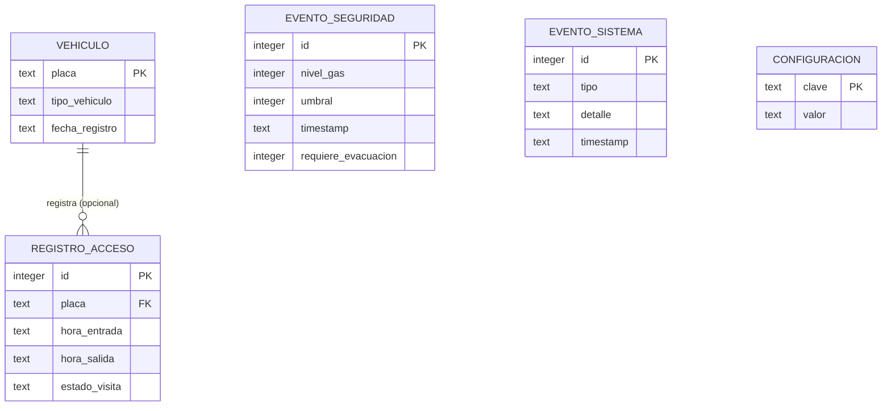

Mapeo JPA: cada entidad de la sección 5 mapea directamente a su tabla, sin una capa de conversión intermedia. Hibernate no gestiona el esquema (`ddl-auto: none`); las tablas las crea `schema.sql`. Con `CREATE TABLE IF NOT EXISTS` la inicialización es idempotente y no borra datos.

Recuperación tras reinicio: al arrancar se lee la capacidad y el umbral desde `configuracion`, se cuentan los registros activos para reconstruir los cupos ocupados y se restablece el estado. El conteo y el estado sobreviven a un corte de energía.

## 21. Configuración

`src/main/resources/application.properties`:

```properties
spring.application.name=Smartparking
server.port=7070

# SQLite con una sola conexion: serializa las escrituras y evita el bloqueo del archivo
spring.datasource.url=jdbc:sqlite:data/smartparking.db
spring.datasource.driver-class-name=org.sqlite.JDBC
spring.datasource.hikari.maximum-pool-size=1
spring.datasource.hikari.connection-init-sql=PRAGMA journal_mode=WAL;

# El esquema lo crea schema.sql, no Hibernate
spring.jpa.hibernate.ddl-auto=none
spring.jpa.database-platform=org.hibernate.community.dialect.SQLiteDialect
spring.jpa.open-in-view=false
spring.sql.init.mode=always
spring.sql.init.schema-locations=classpath:db/schema.sql

smartparking.dispositivo.token=${DISPOSITIVO_TOKEN:cambia-este-token}
smartparking.dispositivo.latido-timeout-ms=5000
smartparking.dispositivo.espera-paso-ms=10000

smartparking.seguridad.admin.usuario=${ADMIN_USUARIO:admin}
smartparking.seguridad.admin.email=${ADMIN_EMAIL:admin@unillanos.edu.co}
smartparking.seguridad.admin.contrasena=${ADMIN_PASSWORD:admin123}
```

La carpeta `data/` debe existir antes del primer arranque, o se ajusta la ruta
del archivo. El token del dispositivo y las credenciales del administrador se
leen de variables de entorno (`DISPOSITIVO_TOKEN`, `ADMIN_USUARIO`,
`ADMIN_EMAIL`, `ADMIN_PASSWORD`) para no subir credenciales al repositorio; los
valores por defecto son solo para desarrollo local. El SSID y la contraseña del
WiFi, y la dirección IP del backend, se configuran en el firmware.

`espera-paso-ms` es el tiempo que el backend espera el `PASO_COMPLETADO` tras
abrir una barrera antes de darlo por no ocurrido (sección 6.1).


## 22. Dependencias

Generar la base con Spring Initializr seleccionando Java 25, Maven y Spring Boot
4.1.x, con los starters: Spring Web (que en Boot 4 se resuelve como
`spring-boot-starter-webmvc`), Spring Data JPA, WebSocket y Validation. Luego
agregar manualmente:

- `org.xerial:sqlite-jdbc`
- `org.hibernate.orm:hibernate-community-dialects` (dialecto de SQLite para Hibernate, sin `<version>`: la gestiona el BOM de Spring Boot)

Spring Boot 4 divide los starters de prueba por módulo, y el Initializr los
añade junto a cada dependencia: `spring-boot-starter-webmvc-test`,
`spring-boot-starter-data-jpa-test`, `spring-boot-starter-validation-test` y
`spring-boot-starter-websocket-test`. Entre todos aportan JUnit 5, Mockito y las
utilidades de prueba de Spring.

En el `pom.xml` se fija además `<finalName>smart-parking-lot</finalName>` para
que el artefacto se llame como indica la sección 28.

No se usa ninguna librería de comunicación serial: el enlace con el dispositivo
es por WebSocket, que ya provee el starter correspondiente.

### 22.1 Cambios de Spring Boot 4 que afectan al código

| Elemento | Serie 3 | Serie 4 |
|---|---|---|
| Starter web | `spring-boot-starter-web` | `spring-boot-starter-webmvc` |
| Starters de prueba | `spring-boot-starter-test` | Uno por módulo |
| Jackson | `com.fasterxml.jackson` (2.x) | `tools.jackson` (3.x) |
| `@DataJpaTest` | `org.springframework.boot.test.autoconfigure.orm.jpa` | `org.springframework.boot.data.jpa.test.autoconfigure` |
| `@WebMvcTest` | `org.springframework.boot.test.autoconfigure.web.servlet` | `org.springframework.boot.webmvc.test.autoconfigure` |
| `@AutoConfigureTestDatabase` | `...test.autoconfigure.jdbc` | `org.springframework.boot.jdbc.test.autoconfigure` |


## 23. Estrategia de pruebas

La arquitectura permite probar el núcleo sin hardware.

- Pruebas unitarias sin Spring: invariantes de `EstadoParqueaderoService`, transiciones de la barrera, `PoliticaAccesoPorDefecto` y el cifrado de contraseñas.
- Pruebas de la capa de servicio (JUnit y Mockito): con repositorios y `DispositivoService` simulados. Verifican que el ingreso descuenta cupo, ordena abrir y guarda el registro; que la salida suma cupo y cierra el registro; que superar el umbral activa alarma, registra evento y dispara la emergencia.
- Pruebas del codificador de mensajes: JSON a mensaje y mensaje a JSON.
- Pruebas de persistencia (`@DataJpaTest`): los repositorios de Spring Data contra una base SQLite temporal.
- Pruebas de la web (`@WebMvcTest`): los controladores con casos de uso simulados.
- Prueba de recuperación: con datos precargados, el arranque reconstruye el conteo correcto.

Meta sugerida: la capa de servicio por encima del 80 por ciento de cobertura.

## 24. Requisitos

Requerimientos funcionales:

| ID | Descripción | Prioridad |
|---|---|---|
| RF-01 | Detectar la llegada de un vehículo a la entrada. | Alta |
| RF-02 | Detectar la llegada de un vehículo a la salida. | Alta |
| RF-03 | Verificar que haya cupo antes de autorizar el ingreso. | Alta |
| RF-04 | Abrir la barrera de entrada si hay cupo. | Alta |
| RF-05 | Abrir la barrera de salida sin condicionar a cupos. | Alta |
| RF-06 | Cerrar la barrera tras el paso del vehículo. | Alta |
| RF-07 | Bloquear el ingreso cuando los cupos sean cero. | Alta |
| RF-08 | Confirmar el paso antes de cerrar la barrera. | Media |
| RF-09 | Mantener el conteo de cupos en tiempo real. | Alta |
| RF-10 | Descontar un cupo por ingreso. | Alta |
| RF-11 | Sumar un cupo por salida, sin exceder la capacidad. | Alta |
| RF-12 | Configurar la capacidad total sin rehacer el sistema. | Media |
| RF-13 | Mostrar los cupos en un indicador visible. | Alta |
| RF-14 | Conteo único y consistente. | Alta |
| RF-15 | Registrar cada ingreso con fecha y hora. | Alta |
| RF-16 | Registrar cada salida con fecha y hora. | Alta |
| RF-17 | Asociar cada salida con su ingreso. | Media |
| RF-18 | Consultar el histórico de accesos. | Media |
| RF-19 | Distinguir visitas activas de finalizadas. | Baja |
| RF-20 | Asociar un identificador de vehículo cuando esté disponible. | Baja |
| RF-21 | Monitorear humo o gas de forma continua. | Alta |
| RF-22 | Umbral de humo configurable. | Media |
| RF-23 | Activar alarma al superar el umbral. | Alta |
| RF-24 | Registrar cada evento de seguridad. | Media |
| RF-25 | Ejecutar el protocolo de emergencia. | Media |
| RF-26 | Reflejar el estado operativo. | Media |
| RF-27 | Bloquear y restablecer el ingreso. | Media |
| RF-28 | Control desde el dashboard: barreras, emergencia, configuración. | Alta |
| RF-29 | Reflejar en el dashboard los cambios en tiempo real. | Alta |
| RF-30 | Reconstruir el estado al iniciar desde la base de datos. | Alta |

Requerimientos no funcionales:

| ID | Descripción | Prioridad |
|---|---|---|
| RNF-01 | Apertura en menos de 2 segundos tras autorizar. | Alta |
| RNF-02 | Actualización del conteo con retraso mínimo. | Alta |
| RNF-03 | Alarma casi inmediata al superar el umbral. | Alta |
| RNF-04 | Conteo exacto, sin dobles conteos ni omisiones. | Alta |
| RNF-05 | Filtrar lecturas espurias de los sensores. | Alta |
| RNF-06 | Operar localmente ante pérdida de conexión. | Media |
| RNF-07 | Operación continua durante el horario. | Alta |
| RNF-08 | Recuperar conteo y estado tras reinicio. | Alta |
| RNF-09 | Favorecer siempre la condición segura. | Alta |
| RNF-10 | Información persistente e íntegra. | Alta |
| RNF-11 | Restringir configuración e historiales a personal autorizado. | Media |
| RNF-12 | Indicador de cupos legible a distancia. | Media |
| RNF-13 | Comprensión inmediata del estado. | Media |
| RNF-14 | Capacidad y umbral ajustables por configuración. | Media |
| RNF-15 | Sistema modular. | Media |
| RNF-16 | Consistencia del conteo central. | Media |
| RNF-17 | Robustez ante el entorno físico. | Baja |
| RNF-18 | La lógica de negocio reside en el backend. | Alta |
| RNF-19 | Modo seguro local del firmware. | Media |
| RNF-20 | Núcleo probable sin hardware. | Media |

## 25. Trazabilidad requisitos a diseño

| Requisito | Dónde se cumple |
|---|---|
| RF-01, RF-02 | Sensores IR y firmware; eventos por el enlace WebSocket. |
| RF-03, RF-07 | `PoliticaAccesoPorDefecto` y `EstadoParqueaderoService` en `AccesoService`. |
| RF-04, RF-05, RF-06 | Comandos de apertura y cierre; máquina de estados de la barrera. |
| RF-08, RNF-09 | Confirmación de paso y transición segura de la barrera. |
| RF-09 a RF-11, RF-14, RNF-04 | `EstadoParqueaderoService` como única fuente de verdad. |
| RF-12, RF-22, RNF-14 | `ConfiguracionService` y `ParametroRepository`. |
| RF-13, RNF-12, RNF-13 | Panel del dashboard (y display I2C opcional). |
| RF-15 a RF-19 | `RegistroAcceso` y `RegistroAccesoRepository`. |
| RF-17 | `findFirstByEstadoVisitaOrderByHoraEntradaAsc` cierra el registro más antiguo al salir. |
| RF-20 | `Vehiculo` opcional. |
| RF-21, RF-23, RF-24 | `HumoService` y `EventoSeguridadRepository`. |
| RF-25, RF-27 | `EmergenciaService` y estado del sistema. |
| RF-26 | Estado en `GET /api/estado` y en el dashboard. |
| RF-28, RF-29 | Controladores REST y WebSocket del tablero. |
| RF-30, RNF-08 | `InicializadorEstado`. |
| RNF-05 | Antirrebote en el firmware. |
| RNF-06, RNF-19 | Modo seguro local del firmware. |
| RNF-10 | SQLite persistente detrás de la capa de repositorio. |
| RNF-11 | `InterceptorAutorizacion` con usuarios, roles y permisos. |
| RNF-15 | Arquitectura en capas y firmware modular. |
| RNF-16 | Conteo central único en el backend. |
| RNF-18, RNF-20 | Lógica en el backend; capa de servicio probable con repositorios simulados. |

## 26. Diagramas UML

### 26.1 Componentes (capas)

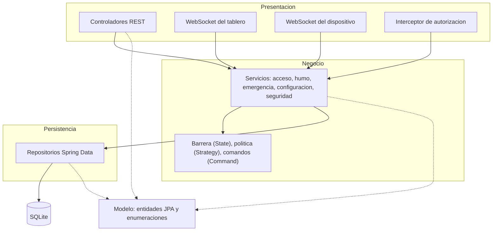

Las flechas continuas son llamadas entre capas, siempre hacia abajo. Las
punteadas indican que las tres capas comparten el mismo modelo de entidades.


### 26.2 Clases del firmware (ESP32-C3)

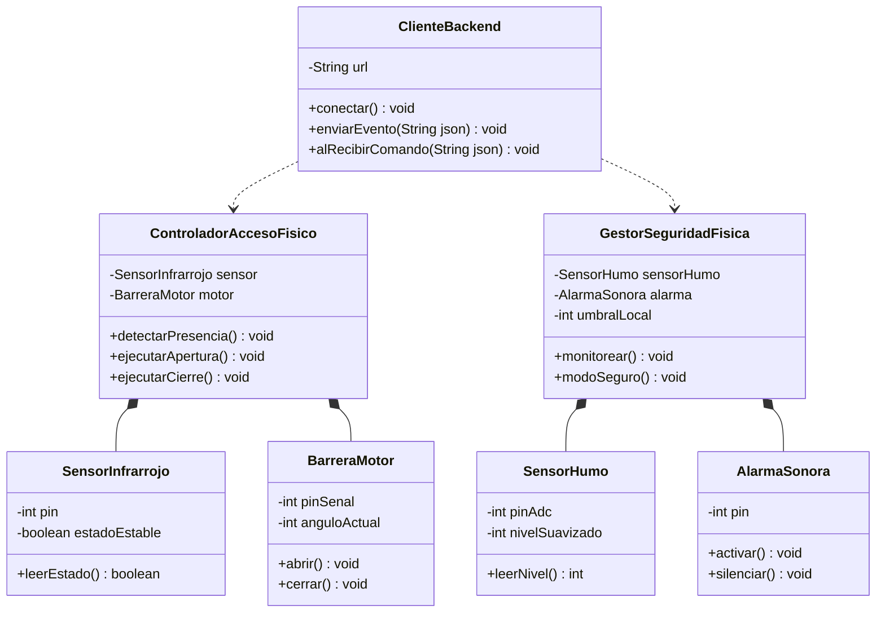

### 26.3 Clases del modelo

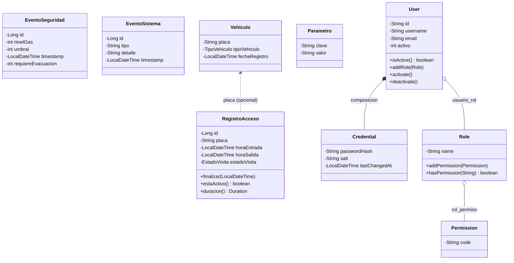

### 26.4 Capa de servicio y repositorio

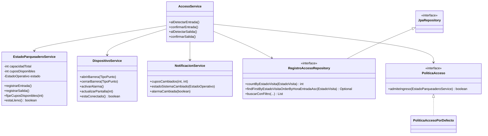


### 26.5 Comandos sobre los actuadores

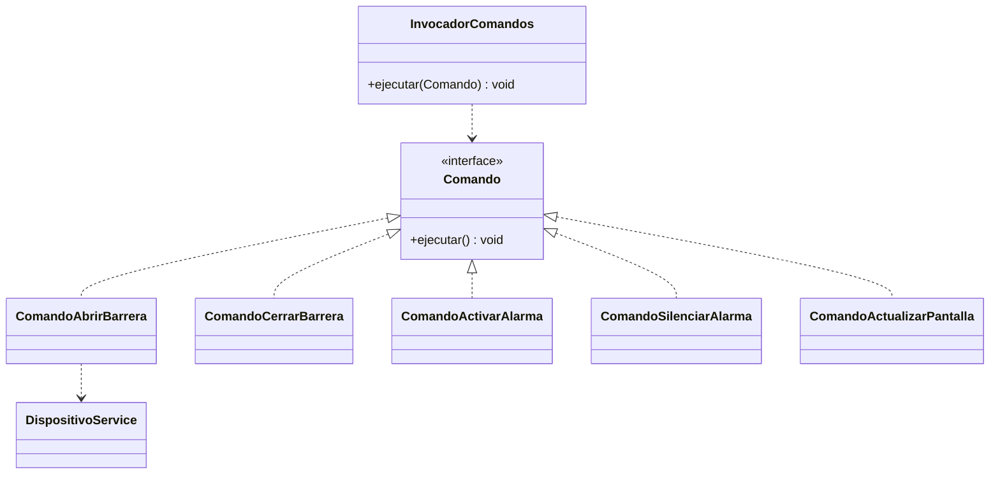

### 26.6 Clases de la capa web

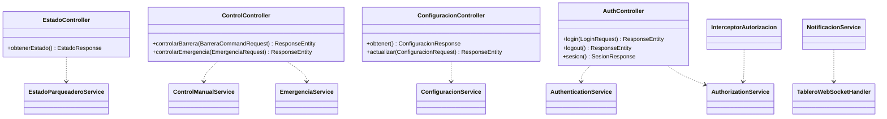

### 26.7 Secuencia: ingreso

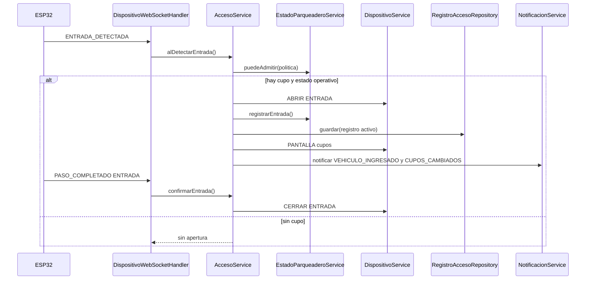

### 26.8 Secuencia: salida

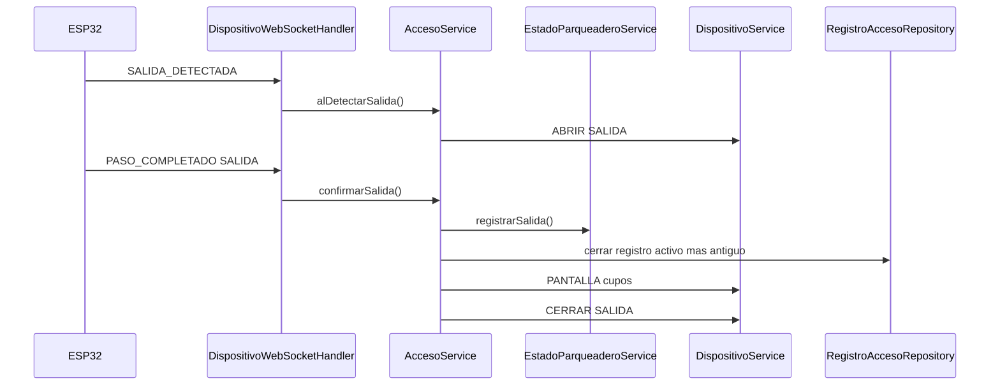

### 26.9 Secuencia: emergencia por humo

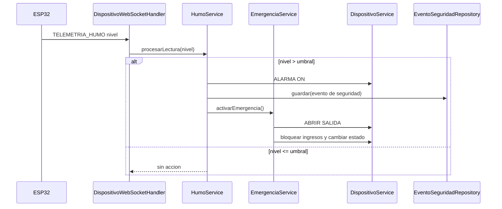

## 27. Instrucciones de implementación

Orden sugerido:

1. Generar el proyecto Spring Boot (Java 25, Maven) con las dependencias de la sección 22. Crear la estructura de paquetes de la sección 4 y colocar `schema.sql`, `application.properties` y la configuración de logs.
2. Implementar el modelo (sección 5): entidades JPA, enumeraciones y el conversor de fechas.
3. Declarar los repositorios de Spring Data (sección 9).
4. Implementar la capa de servicio (sección 11), las máquinas de estado (sección 6), la política (sección 7) y los comandos (sección 12), con pruebas.
5. Implementar el enlace con el dispositivo por WebSocket: handler, sesión y codificador (sección 13.1).
6. Implementar la configuración de beans y los inicializadores de arranque (sección 13.3).
7. Implementar la capa web: controladores, DTOs, WebSocket del tablero, seguridad y manejo de errores (sección 14), con pruebas.
8. Implementar el frontend estático (sección 15).
9. Crear el firmware de la ESP32-C3 (sección 18) según la asignación de pines y las advertencias de la sección 19.

Convenciones:

- Las dependencias van en una sola dirección: web sobre servicio, servicio sobre repositorio. Ninguna capa llama hacia arriba.
- Las reglas de negocio viven en la capa de servicio. Los controladores solo traducen entre HTTP y servicios; los repositorios solo acceden a datos.
- `@Transactional` va en los métodos de servicio, que delimitan cada operación de negocio.
- Nombres de clase en español sin tildes, salvo el modelo de autenticación, que conserva los nombres del UML de la asignatura. Comentarios breves y en español, solo donde aporten.
- Compilar y correr las pruebas después de cada etapa; no avanzar con una etapa rota.
- Salida de consola limpia; nivel de log INFO por defecto.


## 28. Compilación y ejecución

Desde la carpeta `host/`:

```bash
mvn clean package
java -jar target/smart-parking-lot.jar
```

El panel queda disponible en `http://localhost:7070`. En el primer arranque se
crea el usuario administrador con las credenciales de la sección 21; conviene
fijarlas por variables de entorno antes de exponer el tablero:

```bash
ADMIN_PASSWORD=una-clave-propia DISPOSITIVO_TOKEN=un-token-propio java -jar target/smart-parking-lot.jar
```

La ESP32 debe estar en la misma red WiFi y apuntar a la IP del backend. Ajustar
el SSID, la contraseña, la IP del backend y el token en el firmware.

Nota: en Windows el archivo `.jar` queda bloqueado mientras la aplicación corre,
así que hay que detenerla antes de volver a ejecutar `mvn clean package`.


## 29. Limitaciones conocidas y riesgos aceptados

Estas limitaciones son propias del alcance de la maqueta. Se documentan y se aceptan; no se corrigen en esta versión.

- Emparejamiento por orden de llegada: sin reconocimiento de placas, una salida se asocia al registro activo más antiguo. Si un vehículo entra antes pero sale después que otro, las duraciones quedan cruzadas. Si el operador ingresa la placa manualmente, la salida puede emparejarse por esa placa.
- Un solo sensor por punto: el sensor no distingue "el vehículo pasó" de "el vehículo se devolvió", ya que ambos casos liberan el sensor. Puede producir un sobreconteo, que se corrige con la recalibración manual de cupos.
- Sin cifrado (ausencia de TLS): el tráfico entre el navegador, el backend y la ESP32 va en texto plano sobre HTTP y WebSocket. El token de operador viaja sin cifrar y es vulnerable en una red WiFi compartida. En el entorno local y académico se acepta este riesgo; en producción se usaría HTTPS y WSS.

## 30. Anexo: README del repositorio

Publicar este contenido, sin cambios, como `README.md` en la raíz del repositorio.

````markdown
# Smart Parking Lot

Sistema de gestión automatizada de un parqueadero, construido como maqueta a escala. Un dispositivo ESP32-C3 con sensores y actuadores controla el acceso, y un backend en Java con arquitectura en capas mantiene el conteo, la seguridad y el historial, con un panel web en tiempo real.


## Descripción

El sistema controla el acceso vehicular de forma automática, mantiene el conteo de cupos disponibles en tiempo real y vigila la presencia de humo o gas, activando una alarma cuando se supera un umbral configurable. La ESP32-C3 se comunica con el backend por WiFi mediante WebSocket; el backend concentra toda la lógica de negocio y sirve un panel web de control y monitoreo. El acceso al panel se controla con usuarios, roles y permisos. Cada acceso y cada alerta quedan registrados de forma persistente.

## Características

- Detección automática de vehículos en entrada y salida.
- Control automático de barreras con cierre seguro.
- Conteo de cupos en tiempo real, único y persistente.
- Monitoreo continuo de humo con alarma y protocolo de emergencia.
- Panel web de control y monitoreo con actualización en vivo.
- Registro histórico de accesos y de eventos de seguridad.
- Capacidad y umbral configurables sin recompilar.
- Control de acceso al panel por usuarios, roles y permisos.

## Arquitectura

Arquitectura en capas. La capa web recibe la petición y delega en la de servicio; la de servicio aplica las reglas de negocio y pide datos a la de repositorio; la de repositorio habla con SQLite. Las dependencias van siempre hacia abajo. La lógica de negocio reside en el backend; la ESP32 solo detecta, ejecuta y muestra.

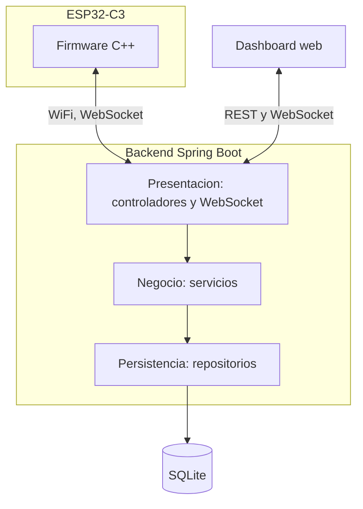

## Stack tecnológico

| Capa | Tecnología |
|---|---|
| Backend | Java 25, Spring Boot 4, Maven |
| Tiempo real y enlace con el dispositivo | Spring WebSocket |
| Persistencia | Spring Data JPA sobre SQLite |
| Frontend | HTML, CSS y JavaScript con Chart.js |
| Dispositivo | ESP32-C3 Super Mini (WiFi) |
| Firmware | C++ con el núcleo Arduino de ESP32 |

## Estructura del repositorio

```
smart-parking-lot/
├── docs/            Documentacion tecnica
├── firmware/        Firmware de la ESP32-C3 (C++)
├── hardware/        Lista de materiales y diagramas de conexion
└── host/            Backend en Java (proyecto Maven Spring Boot)
```

## Requisitos previos

- JDK 25 o superior
- Maven 3.9 o superior
- IDE de Arduino con soporte para ESP32 (o PlatformIO)
- Una ESP32-C3 con los sensores y actuadores descritos en `hardware/`

## Compilación y ejecución

Desde `host/`:

```bash
mvn clean package
java -jar target/smart-parking-lot.jar
```

El panel queda disponible en `http://localhost:7070`. La ESP32 debe estar en la misma red WiFi y apuntar a la IP del backend.

## Equipo

| Integrante | Código |
|---|---|
| Luis Miguel Bahamón González | 160005101 |
| Emerson Andrey Beltrán Álvarez | 160005103 |
| Juan Fernando Fernández Vega | 160005112 |
| Mario Alejandro Rey Reina | 160004833 |
| César Mauricio Pérez Santos | 160005130 |

Universidad de los Llanos — Ingeniería de Sistemas — Tecnologías Avanzadas.

## Licencia

Distribuido bajo la licencia MIT. Ver el archivo `LICENSE`.
````
