# Especificación técnica — Smart Parking Lot

Documento de construcción del proyecto. Reemplaza a las versiones anteriores. Está escrito para servir de plano de implementación: describe el stack, la arquitectura, todas las clases y sus responsabilidades, los contratos, los diagramas y las convenciones, con el detalle suficiente para implementarlo directamente a partir de él.

**Curso:** Tecnologías Avanzadas — Universidad de los Llanos
**Equipo:** Luis Miguel Bahamón González, Emerson Andrey Beltrán Álvarez, Juan Fernando Fernández Vega, Mario Alejandro Rey Reina, César Mauricio Pérez Santos.
**Landmark de la maqueta:** por definir (no afecta el software).

---

## Tabla de contenido

1. Objetivo y alcance
2. Stack tecnológico
3. Topología y arquitectura
4. Estructura de paquetes y carpetas
5. Modelo de dominio
6. Máquinas de estado
7. Política de acceso
8. Eventos de dominio
9. Puertos de entrada
10. Puertos de salida
11. Servicios de aplicación
12. Comandos
13. Adaptadores de infraestructura
14. Capa web
15. Frontend
16. Patrones de diseño aplicados
17. Protocolo del enlace con el dispositivo
18. Firmware de la ESP32-C3
19. Hardware y montaje
20. Base de datos
21. Configuración
22. Dependencias
23. Estrategia de pruebas
24. Requisitos
25. Trazabilidad requisitos a diseño
26. Diagramas UML
27. Instrucciones de implementación
28. Compilación y ejecución
29. Limitaciones conocidas y riesgos aceptados
30. Anexo: README del repositorio

---

## 1. Objetivo y alcance

Maqueta a escala de un parqueadero inteligente. Un dispositivo con sensores y actuadores controla el acceso vehicular de forma automática, y un backend mantiene el conteo de cupos en tiempo real y vigila humo o gas, activando una alarma cuando se supera un umbral configurable. La operación y el monitoreo se hacen desde un panel web en tiempo real, y la actividad queda registrada de forma persistente.

Dentro del alcance: detección de vehículos, control de barreras, conteo de cupos, registro histórico, monitoreo de humo con alarma y protocolo de emergencia, panel web de control y monitoreo, persistencia.

Fuera del alcance: cobro por estadía, reserva de cupos, asignación de plazas individuales, reconocimiento automático de placas.

## 2. Stack tecnológico

| Componente | Elección |
|---|---|
| Lenguaje del backend | Java 17 |
| Framework | Spring Boot 3.x |
| Construcción | Maven |
| Web y REST | Spring Web |
| Tiempo real y enlace con el dispositivo | Spring WebSocket |
| Validación | Spring Validation |
| Persistencia | Spring Data JPA sobre SQLite |
| Driver de base de datos | org.xerial:sqlite-jdbc |
| Dialecto Hibernate para SQLite | org.hibernate.orm:hibernate-community-dialects |
| Frontend | HTML, CSS y JavaScript, con Chart.js |
| Placa | ESP32-C3 Super Mini (WiFi y Bluetooth, lógica de 3.3V) |
| Firmware | C++ con el núcleo Arduino de ESP32 |
| Enlace ESP32 a backend | WebSocket sobre WiFi, mensajes JSON |
| Pruebas | JUnit 5, Mockito y utilidades de prueba de Spring Boot |

## 3. Topología y arquitectura

### 3.1 Topología física

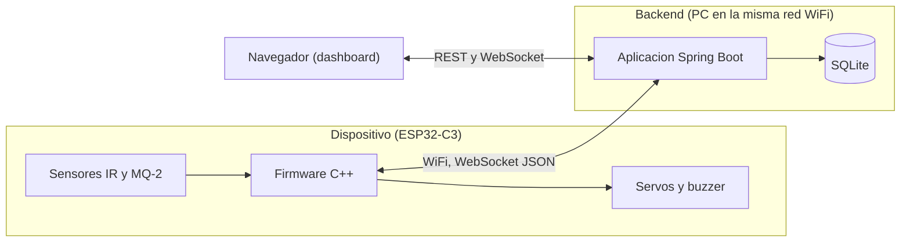

La ESP32-C3 y el backend están en la misma red WiFi. La ESP32 abre una conexión WebSocket hacia el backend (la ESP32 es el cliente y el backend el servidor). Por esa conexión la ESP32 envía eventos y telemetría, y el backend envía comandos. El dashboard se sirve desde el mismo backend y se abre en un navegador de la red.

### 3.2 Arquitectura de software

Arquitectura hexagonal (puertos y adaptadores).

Regla principal: el dominio y la aplicación son el centro y no dependen de Spring, de JPA ni de ninguna tecnología concreta. No llevan anotaciones de framework. Se comunican con el exterior a través de puertos (interfaces). Los adaptadores implementan esos puertos con tecnología concreta y viven en las capas externas.

Regla de dependencias: las dependencias apuntan hacia adentro. La infraestructura y la web dependen del dominio; el dominio no depende de nadie.

Autoridad de la lógica: toda la lógica de negocio (conteo, autorización, protocolo de emergencia) reside en el backend. El firmware solo detecta, ejecuta y muestra, y mantiene un modo seguro local para cuando pierde la conexión.

Integración de Spring sin invadir el núcleo: los servicios de aplicación y los objetos de dominio son clases planas de Java. Se declaran como beans en una clase de configuración (`ConfiguracionBeans`) de la capa de infraestructura, inyectándoles las implementaciones de los puertos. Solo los adaptadores (web, persistencia, enlace con el dispositivo) y la clase de arranque usan anotaciones de Spring.

## 3.3 Concurrencia y consistencia

Los mensajes del dispositivo y las peticiones del dashboard pueden llegar en hilos distintos. El `EstadoParqueadero` es estado mutable compartido, así que dos eventos simultáneos podrían leer el mismo valor de cupos y descontar dos veces, dejando el conteo inconsistente. Además, SQLite bloquea el archivo completo al escribir, y dos escrituras a la vez (un ingreso y una telemetría de humo) fallarían por base bloqueada.

Regla obligatoria: los eventos que cambian el estado o escriben en la base se procesan en serie, con un ejecutor de un solo hilo en la capa de aplicación. Con esto no hay mutación concurrente del conteo ni escrituras simultáneas a SQLite. Como complemento, el pool de conexiones se fija en tamaño 1 y se habilita el modo WAL (sección 21).

Modelo de conteo con reserva: al autorizar un ingreso se reserva el cupo de inmediato (se descuenta), para que un segundo vehículo no sea admitido al último lugar. La reserva se confirma cuando llega `PASO_COMPLETADO`. Si vence el tiempo de espera sin paso y el sensor quedó libre, la reserva se revierte (se devuelve el cupo). En la salida no hay reserva: el cupo se suma al confirmarse el paso.

Transacciones: las transacciones gobiernan la base de datos, no el conteo en memoria. El orden es persistir primero y mutar el conteo solo si el guardado tuvo éxito, o compensar si falla. La anotación `@Transactional` va en el adaptador de persistencia, no en los servicios de aplicación, para no meter anotaciones de framework en el núcleo.

## 4. Estructura de paquetes y carpetas

```
com.unillanos.smartparking
├── AplicacionSmartParking.java           Clase de arranque (@SpringBootApplication)
├── dominio                               Java puro, sin anotaciones de framework
│   ├── modelo                            EstadoParqueadero, RegistroAcceso, EventoSeguridad, Vehiculo, EventoSistema, enums
│   ├── barrera                           Barrera y estados (patron State)
│   ├── politica                          PoliticaAcceso y PoliticaAccesoPorDefecto (patron Strategy)
│   ├── evento                            EventoDominio y eventos concretos
│   └── puerto
│       ├── entrada                       Interfaces de casos de uso
│       └── salida                        PuertoPasarelaDispositivo, repositorios, PuertoPublicadorEventos
├── aplicacion                            Java puro, sin anotaciones de framework
│   ├── servicio                          Implementaciones de los casos de uso
│   └── comando                           Comando, comandos concretos e InvocadorComandos
├── infraestructura
│   ├── dispositivo                       Enlace WebSocket con la ESP32 (adaptador de entrada y de salida)
│   ├── persistencia
│   │   ├── entidad                       Entidades JPA
│   │   ├── repositorio                   Interfaces de Spring Data
│   │   ├── adaptador                     Adaptadores que implementan los puertos de repositorio
│   │   └── mapeador                      Conversion entre entidades JPA y objetos de dominio
│   └── config                            ConfiguracionBeans, propiedades y arranque
└── web
    ├── controlador                       Controladores REST
    ├── dto                               Objetos de transferencia
    ├── websocket                         Handler del tablero, configuracion y publicador de eventos
    ├── seguridad                         Interceptor de token de operador
    └── error                             Manejo global de errores
```

Recursos en `src/main/resources`: `application.yml`, `db/schema.sql`, `logback-spring.xml` y los archivos del dashboard en `static/`. El firmware va en una carpeta `firmware/` en la raíz del repositorio.

## 5. Modelo de dominio

Clases planas de Java, sin anotaciones. Identificadores en español sin tildes, según la convención práctica de Java.

### 5.1 Enumeraciones

- `EstadoOperativo`: `OPERATIVO`, `LLENO`, `EMERGENCIA`.
- `TipoPunto`: `ENTRADA`, `SALIDA`.
- `TipoVehiculo`: `CARRO`, `TURBO`.
- `EstadoVisita`: `ACTIVO`, `FINALIZADO`.

### 5.2 Entidades y objetos de valor

**EstadoParqueadero** (raíz de agregado). Única fuente de verdad del conteo y del estado.

- Campos: `int capacidadTotal`, `int cuposDisponibles`, `EstadoOperativo estado`.
- Responsabilidad: mantener la invariante `0 <= cuposDisponibles <= capacidadTotal` y gobernar el estado operativo.
- Métodos: `boolean puedeAdmitir(PoliticaAcceso politica)`, `void registrarEntrada()` (descuenta un cupo; lanza excepción de dominio si no hay), `void registrarSalida()` (suma un cupo sin exceder), `void actualizarCapacidad(int nueva)`, `void cambiarEstado(EstadoOperativo nuevo)`, `boolean estaLleno()`.

**RegistroAcceso** (entidad). Equivale a una visita.

- Campos: `Long id`, `Vehiculo vehiculo` (opcional), `LocalDateTime horaEntrada`, `LocalDateTime horaSalida` (nula mientras está activa), `EstadoVisita estadoVisita`.
- Métodos: `void finalizar(LocalDateTime cuando)`, `boolean estaActivo()`, `Duration duracion()`.

**EventoSeguridad** (entidad).

- Campos: `Long id`, `int nivelGasRegistrado`, `int umbral`, `LocalDateTime timestamp`, `boolean requiereEvacuacion`.

**Vehiculo** (opcional). Solo se usa si se ingresa una placa manualmente desde el dashboard.

- Campos: `String placa`, `TipoVehiculo tipoVehiculo`, `LocalDateTime fechaRegistro`.

**EventoSistema** (entidad, bitácora).

- Campos: `Long id`, `String tipo`, `String detalle`, `LocalDateTime timestamp`.

Notas de diseño:

- Los cupos se manejan como un conteo agregado en `EstadoParqueadero`. No se modela una clase de cupo individual porque el alcance no lo requiere.
- Con solo sensores IR no se conoce la placa del vehículo. Por eso `Vehiculo` es opcional (RF-20). El emparejamiento de una salida con su entrada se hace por orden de llegada: se cierra el registro activo más antiguo.

## 6. Máquinas de estado

### 6.1 Barrera (patrón State)

- `Barrera`: campos `TipoPunto punto`, `EstadoBarrera estado`. Métodos: `autorizar()`, `marcarAbierta()`, `marcarVehiculoPaso()`, `marcarCerrada()`, `marcarVehiculoPresente()`, `marcarTiempoDeEspera()`. Cada método delega en el estado actual, que decide la transición.
- `EstadoBarrera` (interfaz): declara los eventos de transición.
- Estados concretos: `EstadoCerrada`, `EstadoAbriendo`, `EstadoAbierta`, `EstadoCerrando`.

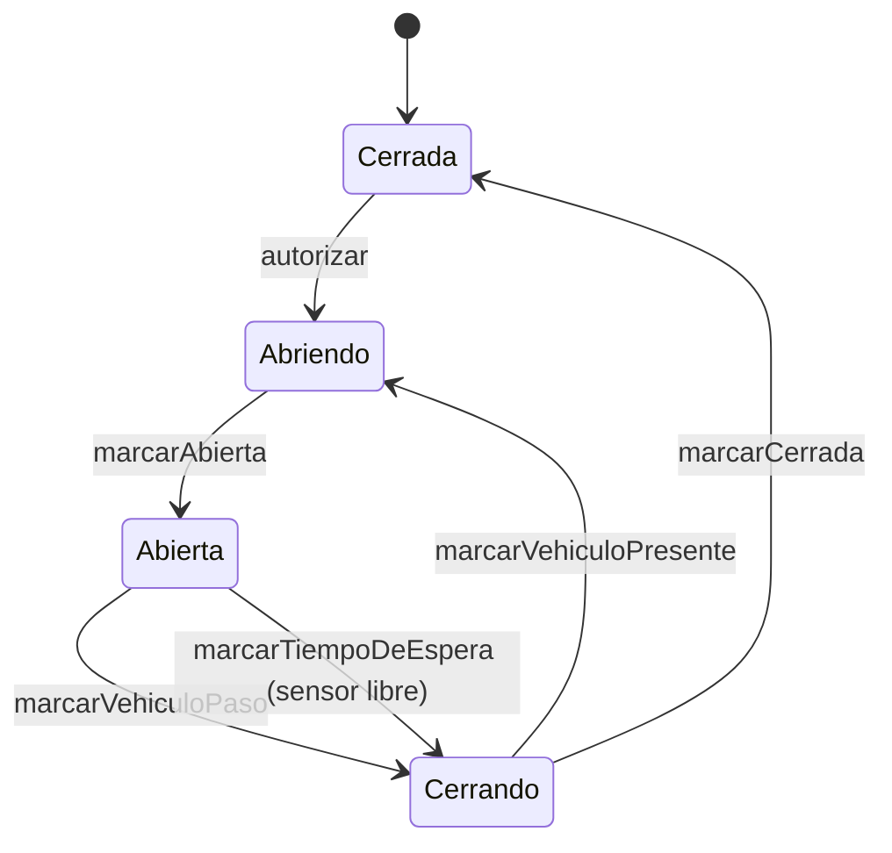

La transición de Cerrando a Abriendo cuando el sensor sigue detectando presencia implementa la condición segura: no cerrar en caso de duda. La actuación física (mover el servo) la ordena el servicio de aplicación a través de `PuertoPasarelaDispositivo` cuando una transición implica abrir o cerrar; el estado en sí no toca el hardware.

Tiempo de espera (vehículo fantasma): al abrir una barrera, el backend programa un tiempo de espera. Si vence sin `PASO_COMPLETADO`, hay dos casos. Si el sensor quedó libre, el vehículo no cruzó (se devolvió o fue un falso positivo): se cierra la barrera y se revierte la reserva del cupo. Si el sensor sigue ocupado, hay un vehículo detenido en el punto: la barrera no se cierra, se mantiene abierta y se avisa al operador. Nunca se cierra la barrera sobre un sensor ocupado (RNF-09).

### 6.2 Estado del sistema

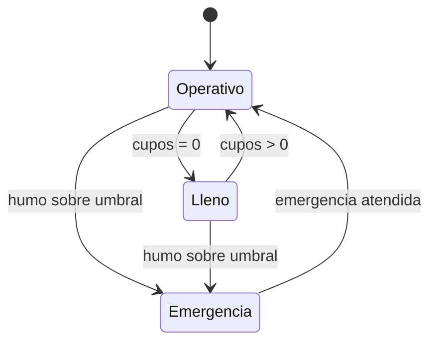

En Lleno se bloquea la apertura de la entrada; la salida sigue disponible. En Emergencia se ejecuta el protocolo: habilitar salida, bloquear ingresos y sostener la alarma.

## 7. Política de acceso (patrón Strategy)

- `PoliticaAcceso` (interfaz): `boolean admiteIngreso(EstadoParqueadero estado)`.
- `PoliticaAccesoPorDefecto`: permite el ingreso si `cuposDisponibles > 0` y el estado es `OPERATIVO`.

Se declara como bean en `ConfiguracionBeans`. Cambiar la regla solo implica una nueva implementación, sin tocar los casos de uso.

## 8. Eventos de dominio

Se publican hacia el dashboard a través de `PuertoPublicadorEventos`.

- `EventoDominio` (interfaz o clase base): expone `LocalDateTime ocurridoEn()`.
- `VehiculoIngresadoEvento`, `VehiculoEgresadoEvento`, `CuposCambiadosEvento`, `UmbralHumoSuperadoEvento`, `EstadoSistemaCambiadoEvento`, `AlarmaCambiadaEvento`.

## 9. Puertos de entrada

Interfaces en `dominio.puerto.entrada`. Son lo que la aplicación ofrece a los adaptadores de entrada (web y enlace con el dispositivo).

```java
public interface RegistrarEntradaCasoUso {
    void alDetectarEntrada();     // sensor de entrada activado
    void confirmarEntrada();      // el vehiculo termino de pasar
}

public interface RegistrarSalidaCasoUso {
    void alDetectarSalida();
    void confirmarSalida();
}

public interface ProcesarLecturaHumoCasoUso {
    void procesarLectura(int nivel);
}

public interface EjecutarEmergenciaCasoUso {
    void activarEmergencia();
    void limpiarEmergencia();
}

public interface GestionarConfiguracionCasoUso {
    void actualizarCapacidad(int capacidad);
    void actualizarUmbral(int umbral);
    Configuracion obtenerConfiguracion();
}

public interface ConsultarEstadoCasoUso {
    EstadoActual obtenerEstado();
}

public interface ConsultarHistorialCasoUso {
    List<RegistroAcceso> obtenerRegistros(FiltroRegistros filtro);
    List<EventoSeguridad> obtenerEventosSeguridad(FiltroEventos filtro);
}

public interface ControlManualCasoUso {
    void abrirBarrera(TipoPunto punto);
    void cerrarBarrera(TipoPunto punto);
}

public interface SincronizarCuposCasoUso {
    void fijarCuposOcupados(int ocupados);   // recalibracion manual del conteo
}
```

`Configuracion`, `EstadoActual`, `FiltroRegistros` y `FiltroEventos` son objetos simples que agrupan datos de entrada o de salida.

## 10. Puertos de salida

Interfaces en `dominio.puerto.salida`.

```java
public interface PuertoPasarelaDispositivo {
    void abrirBarrera(TipoPunto punto);
    void cerrarBarrera(TipoPunto punto);
    void activarAlarma();
    void silenciarAlarma();
    void actualizarPantalla(int cuposDisponibles);
    void configurarUmbral(int umbral);
}

public interface RepositorioRegistroAcceso {
    RegistroAcceso guardar(RegistroAcceso registro);
    int contarActivos();
    Optional<RegistroAcceso> buscarActivoMasAntiguo();   // para asociar la salida con su ingreso
    List<RegistroAcceso> buscarTodos(FiltroRegistros filtro);
}

public interface RepositorioEventoSeguridad {
    EventoSeguridad guardar(EventoSeguridad evento);
    List<EventoSeguridad> buscarTodos(FiltroEventos filtro);
}

public interface RepositorioEventoSistema {
    EventoSistema guardar(EventoSistema evento);
}

public interface RepositorioConfiguracion {
    int obtenerCapacidad();
    int obtenerUmbral();
    EstadoOperativo obtenerEstadoSistema();
    void guardarCapacidad(int capacidad);
    void guardarUmbral(int umbral);
    void guardarEstadoSistema(EstadoOperativo estado);
}

public interface RepositorioVehiculo {   // opcional
    Vehiculo guardar(Vehiculo vehiculo);
    Optional<Vehiculo> buscarPorPlaca(String placa);
}

public interface PuertoPublicadorEventos {
    void publicar(EventoDominio evento);
}
```

## 11. Servicios de aplicación

Clases planas en `aplicacion.servicio` que implementan los puertos de entrada. Reciben los puertos de salida por constructor. Se declaran como beans en `ConfiguracionBeans`.

| Servicio | Implementa | Responsabilidad |
|---|---|---|
| `RegistrarEntradaServicio` | `RegistrarEntradaCasoUso` | Al detectar entrada: consulta la política; si admite, reserva el cupo (lo descuenta), ordena abrir, guarda el registro activo, actualiza pantalla y publica eventos. Al confirmar el paso, ordena cerrar. Si vence el tiempo de espera sin paso y el sensor quedó libre, revierte la reserva. Si no admite, mantiene la entrada en espera. |
| `RegistrarSalidaServicio` | `RegistrarSalidaCasoUso` | Al detectar salida: ordena abrir sin condicionar a cupos. Al confirmar el paso, suma cupo, cierra el registro activo más antiguo, actualiza pantalla y publica eventos. |
| `ProcesarLecturaHumoServicio` | `ProcesarLecturaHumoCasoUso` | Compara la lectura con el umbral. Si lo supera, activa la alarma, registra el evento de seguridad y dispara la emergencia. |
| `EjecutarEmergenciaServicio` | `EjecutarEmergenciaCasoUso` | Habilita la salida, bloquea ingresos, sostiene la alarma, cambia el estado a EMERGENCIA y registra la bitácora. La limpieza restablece el estado. |
| `ConfiguracionServicio` | `GestionarConfiguracionCasoUso` | Actualiza capacidad y umbral en el repositorio; propaga el umbral al dispositivo. |
| `ConsultaEstadoServicio` | `ConsultarEstadoCasoUso` | Devuelve cupos, capacidad, estado y estado de alarma. |
| `ConsultaHistorialServicio` | `ConsultarHistorialCasoUso` | Consulta registros y eventos de seguridad con filtros. |
| `ControlManualServicio` | `ControlManualCasoUso` | Abre o cierra una barrera por orden del operador desde el dashboard. |
| `SincronizarCuposServicio` | `SincronizarCuposCasoUso` | Recalibra el conteo: fija los cupos ocupados reales, ajusta el `EstadoParqueadero`, reconcilia los registros activos para que el valor sobreviva a un reinicio, actualiza la pantalla y publica el cambio. |

Los servicios que actúan sobre el hardware lo hacen mediante comandos (sección 12), para centralizar el registro de las acciones.

## 12. Comandos (patrón Command)

Encapsulan las acciones sobre los actuadores como objetos. Un invocador único las ejecuta y registra.

```java
public interface Comando {
    void ejecutar();
}
```

Comandos concretos, cada uno con referencia a `PuertoPasarelaDispositivo` y sus parámetros: `ComandoAbrirBarrera`, `ComandoCerrarBarrera`, `ComandoActivarAlarma`, `ComandoSilenciarAlarma`, `ComandoActualizarPantalla`.

- `InvocadorComandos`: recibe un `Comando`, lo ejecuta y registra la acción en el log.

## 13. Adaptadores de infraestructura

### 13.1 Enlace con el dispositivo (WebSocket)

- `PasarelaDispositivoWebSocket` (`@Component`) implementa `PuertoPasarelaDispositivo`. Formatea cada acción como un mensaje JSON del protocolo y lo envía por la sesión WebSocket abierta con la ESP32.
- `ManejadorDispositivoWebSocket extends TextWebSocketHandler` (`@Component`): es el adaptador de entrada del lado del hardware. Guarda la sesión de la ESP32, recibe los mensajes entrantes, los decodifica y los despacha al caso de uso correspondiente (`RegistrarEntradaCasoUso`, `RegistrarSalidaCasoUso`, `ProcesarLecturaHumoCasoUso`).
- `CodificadorMensajesDispositivo`: convierte entre los mensajes del protocolo y JSON.
- `WebSocketDispositivoConfig` (`@Configuration`, `@EnableWebSocket`): registra el handler del dispositivo en la ruta `/dispositivo`.
- `PropiedadesDispositivo` (`@ConfigurationProperties(prefix = "smartparking.dispositivo")`): token del dispositivo y tiempo de espera del latido.

Al perder la sesión con la ESP32, el backend registra el evento; la ESP32 entra en su modo seguro por su cuenta.

Vigilancia de latidos (obligatoria): si la ESP32 pierde energía de golpe no envía el cierre del WebSocket y la sesión queda huérfana en memoria. Una tarea programada (`@Scheduled`) revisa el último `LATIDO` recibido; si supera el tiempo de tolerancia (`latido-timeout-ms`), cierra la sesión, marca el dispositivo como desconectado y lo refleja en el tablero.

### 13.2 Persistencia

Se separan las entidades JPA de las de dominio para que las anotaciones de persistencia no contaminen el núcleo.

- Entidades JPA en `persistencia.entidad`: `RegistroAccesoEntity`, `EventoSeguridadEntity`, `EventoSistemaEntity`, `ConfiguracionEntity`, `VehiculoEntity`, anotadas con `@Entity` y mapeadas a las tablas del esquema.
- Repositorios de Spring Data en `persistencia.repositorio`: por ejemplo `RegistroAccesoJpaRepository extends JpaRepository<RegistroAccesoEntity, Long>`, con los métodos derivados necesarios.
- Adaptadores en `persistencia.adaptador` que implementan los puertos de repositorio del dominio y delegan en Spring Data, convirtiendo con los mapeadores: `RepositorioRegistroAccesoAdapter`, `RepositorioEventoSeguridadAdapter`, `RepositorioEventoSistemaAdapter`, `RepositorioConfiguracionAdapter`, `RepositorioVehiculoAdapter`.
- Mapeadores en `persistencia.mapeador`.

### 13.3 Configuración y arranque

- `ConfiguracionBeans` (`@Configuration`): declara como beans los objetos del núcleo (política, servicios de aplicación, invocador de comandos), inyectándoles los adaptadores de salida.
- `InicializadorEstado` (`ApplicationRunner`): al iniciar, lee capacidad y umbral desde `RepositorioConfiguracion`, cuenta los registros activos para reconstruir los cupos ocupados, fija el estado del `EstadoParqueadero` y, cuando la ESP32 se conecta, le propaga el umbral. Implementa la recuperación tras reinicio.

## 14. Capa web

### 14.1 Controladores REST

| Método y ruta | Controlador | Función | Acceso |
|---|---|---|---|
| `GET /api/estado` | `EstadoController` | Cupos, capacidad, estado y alarma. | Lectura |
| `GET /api/registros` | `HistorialController` | Historial de accesos, con filtros. | Lectura |
| `GET /api/eventos-seguridad` | `HistorialController` | Historial de eventos de seguridad. | Lectura |
| `GET /api/configuracion` | `ConfiguracionController` | Configuración actual. | Lectura |
| `POST /api/configuracion` | `ConfiguracionController` | Actualizar capacidad o umbral. | Operador |
| `POST /api/control/barrera` | `ControlController` | Abrir o cerrar una barrera. | Operador |
| `POST /api/control/emergencia` | `ControlController` | Forzar o limpiar la emergencia. | Operador |
| `POST /api/control/sincronizar-cupos` | `ControlController` | Recalibrar el conteo de cupos ocupados. | Operador |

Los controladores dependen de las interfaces de casos de uso y convierten entre DTOs y el dominio.

### 14.2 DTOs

En `web.dto`: `EstadoResponse`, `RegistroResponse`, `EventoSeguridadResponse`, `ConfiguracionResponse`, `ConfiguracionRequest`, `BarreraCommandRequest`, `EmergenciaRequest`. Las peticiones se validan con Spring Validation.

### 14.3 WebSocket del tablero

- `ManejadorTableroWebSocket extends TextWebSocketHandler`: mantiene las sesiones de los navegadores y difunde mensajes JSON.
- `WebSocketTableroConfig` (`@Configuration`, `@EnableWebSocket`): registra el handler en la ruta `/tablero`.
- `PublicadorEventosWebSocket` (`@Component`) implementa `PuertoPublicadorEventos`: serializa cada `EventoDominio` a JSON y lo difunde por el handler del tablero.

Hay dos rutas WebSocket distintas: `/dispositivo` para la ESP32 y `/tablero` para los navegadores.

### 14.4 Seguridad

- `InterceptorTokenOperador` (`HandlerInterceptor`): exige una cabecera con un token de operador en las rutas de control y configuración. El token se define en `application.yml`. Las rutas de lectura quedan abiertas en la red local.
- `ConfiguracionWeb` (`@Configuration`): registra el interceptor sobre `POST /api/configuracion` y `POST /api/control/**`.

Es una protección mínima suficiente para el alcance. Como mejora futura se puede sustituir por Spring Security.

### 14.5 Manejo de errores

- `ManejadorGlobalErrores` (`@RestControllerAdvice`): traduce las excepciones de dominio a códigos HTTP con un cuerpo de error claro.

## 15. Frontend

Archivos estáticos servidos por Spring desde `src/main/resources/static`:

- `index.html`: panel con cupos disponibles en grande, capacidad, estado operativo y estado de alarma; controles de operador (abrir y cerrar barreras, forzar y limpiar emergencia, cambiar capacidad y umbral); tablas de historial de accesos y de eventos de seguridad; gráficos con Chart.js.
- `css/styles.css`: estilo sobrio, con énfasis en la legibilidad del número de cupos a distancia.
- `js/app.js`: cliente WebSocket a `/tablero` para actualización en vivo, llamadas REST para historial y configuración, y render de los gráficos.

El panel es el indicador visible de cupos por defecto (RF-13). Un display físico es opcional.

## 16. Patrones de diseño aplicados

| Patrón | Dónde | Problema que resuelve |
|---|---|---|
| Adapter | `PasarelaDispositivoWebSocket` sobre WebSocket; adaptadores de repositorio sobre Spring Data | Aislar la tecnología detrás de las interfaces del dominio. |
| Repository | Puertos de repositorio y sus adaptadores | Abstraer el acceso a datos y permitir pruebas sin base de datos real. |
| State | `Barrera` y sus estados | Gobernar transiciones sin condicionales dispersos. |
| Observer | Publicación de eventos hacia el dashboard | Desacoplar quién genera un evento de quién reacciona. |
| Command | Acciones sobre actuadores más `InvocadorComandos` | Encapsular acciones y centralizar su registro. |
| Strategy | `PoliticaAcceso` | Cambiar la regla de admisión sin tocar los casos de uso. |
| Facade | Servicios de aplicación | Entrada única y limpia hacia el núcleo. |
| Factory Method | Creación de estados de barrera y de comandos | Centralizar la construcción de objetos. |

Sobre Singleton: se evita el Singleton clásico. Los recursos únicos (fuente de datos, sesión del dispositivo, configuración) existen como una sola instancia porque el contenedor de Spring gestiona su ciclo de vida y los inyecta. Se obtiene una sola instancia sin acoplamiento oculto y sin dificultar las pruebas.

## 17. Protocolo del enlace con el dispositivo

Mensajes JSON sobre la conexión WebSocket entre la ESP32 y el backend. Es la frontera formal entre hardware y software. La ESP32 se conecta a `ws://<ip-del-backend>:7070/dispositivo` y se identifica con el token configurado.

Del dispositivo hacia el backend:

| Mensaje | Significado |
|---|---|
| `{"tipo":"LISTO"}` | El firmware terminó de iniciar y conectó. |
| `{"tipo":"ENTRADA_DETECTADA"}` | Vehículo presente en la entrada. |
| `{"tipo":"SALIDA_DETECTADA"}` | Vehículo presente en la salida. |
| `{"tipo":"PASO_COMPLETADO","punto":"ENTRADA"}` | El vehículo terminó de pasar (ENTRADA o SALIDA). |
| `{"tipo":"TELEMETRIA_HUMO","nivel":512}` | Lectura del sensor de humo (0 a 4095 en el ADC de la ESP32). |
| `{"tipo":"LATIDO"}` | Señal periódica de vida del firmware. |
| `{"tipo":"BARRERA_BLOQUEADA","punto":"ENTRADA"}` | La barrera no pudo cerrar porque el sensor sigue ocupado (vehículo detenido en el punto). |

Del backend hacia el dispositivo:

| Mensaje | Acción |
|---|---|
| `{"tipo":"ABRIR","punto":"ENTRADA"}` | Abrir la barrera (ENTRADA o SALIDA). |
| `{"tipo":"CERRAR","punto":"ENTRADA"}` | Cerrar la barrera. |
| `{"tipo":"ALARMA","estado":"ON"}` | Activar o silenciar la alarma (ON u OFF). |
| `{"tipo":"PANTALLA","cupos":5}` | Mostrar los cupos (solo si hay display). |
| `{"tipo":"CONFIG_UMBRAL","umbral":400}` | Fijar el umbral de humo en el firmware para el modo seguro. |
| `{"tipo":"PING"}` | Solicitar un latido inmediato. |

Reglas: el backend es la autoridad de negocio; el firmware solo detecta, ejecuta y muestra. El firmware confirma el fin del paso solo cuando el sensor queda liberado de forma estable, tras antirrebote. Si la conexión se cae por más del tiempo configurado, el firmware entra en modo seguro (entrada cerrada, salida permitida, alarma si detecta humo).

## 18. Firmware de la ESP32-C3

C++ con el núcleo Arduino de ESP32. Librerías: `WiFi` para la conexión, una librería de cliente WebSocket (por ejemplo arduinoWebSockets) y `ArduinoJson` para los mensajes.

### 18.1 Responsabilidades

- Conectarse a la red WiFi y mantener la conexión WebSocket con el backend.
- Leer los dos sensores IR con antirrebote, para no generar eventos duplicados.
- Leer el sensor MQ-2 por una entrada del ADC1 y enviarlo periódicamente como telemetría.
- Mover los servos de las barreras al recibir comandos.
- Encender o apagar el buzzer al recibir comandos.
- Enviar latidos periódicos y aplicar el modo seguro ante ausencia de backend.

### 18.2 Estructura del firmware

```
firmware/
├── smart_parking.ino        Configuracion, conexion WiFi y bucle principal
├── ClienteBackend.h/.cpp    Conexion WebSocket, envio de eventos y recepcion de comandos
├── SensorInfrarrojo.h/.cpp  Lectura IR con antirrebote
├── SensorHumo.h/.cpp        Lectura y suavizado del MQ-2
├── BarreraMotor.h/.cpp      Control de un servo (abrir y cerrar)
├── AlarmaSonora.h/.cpp      Control del buzzer
├── ControladorAccesoFisico.h/.cpp   Coordina los sensores y actuadores de acceso
└── GestorSeguridadFisica.h/.cpp     Coordina el sensor de humo, la alarma y el modo seguro
```

El firmware es no bloqueante: se apoya en `millis()` para el muestreo, los latidos y el antirrebote. Selección de placa en el IDE: ESP32C3 Dev Module, con USB CDC habilitado.

### 18.3 Consideraciones

- El MQ-2 tiene un calentador que necesita estabilizarse: recién encendido arroja lecturas altas falsas. El firmware ignora las lecturas de humo durante una ventana de calentamiento (60 a 120 segundos), pero el control de acceso arranca de una; no se bloquea todo el arranque ni el `LISTO` por el sensor.
- El umbral de humo se evalúa en el backend, pero el firmware guarda la última copia recibida para el modo seguro.
- El antirrebote de los sensores IR mide con `millis()` que la señal se mantenga estable durante N milisegundos, sin bloquear el ciclo, y evita que un mismo vehículo genere varios eventos.
- Seguridad y cierre (vehículos pegados): la barrera baja apenas el sensor queda libre, para obligar a un segundo vehículo pegado a detenerse, y nunca baja mientras el sensor sigue ocupado. Si tras una orden de cierre el sensor sigue ocupado, el firmware mantiene la barrera arriba y envía `BARRERA_BLOQUEADA`.

## 19. Hardware y montaje

### 19.1 Lista de materiales (lo adquirido)

| Componente | Cantidad |
|---|---|
| ESP32-C3 Super Mini | 1 |
| Sensor infrarrojo de obstáculo | 2 |
| Sensor MQ-2 | 1 |
| Servomotor SG90 | 2 |
| Buzzer activo de tres pines | 1 |
| Fuente externa de 5V y al menos 2A para los servos | 1 |

Elementos adicionales necesarios: resistencias para el divisor de voltaje del MQ-2, protoboard y cables. Display de cupos: opcional; si se desea uno físico, usar un módulo I2C de dos pines (por ejemplo TM1637 o una pantalla I2C), no un display de siete segmentos suelto, por la cantidad de pines de la placa.

### 19.2 Advertencias por la lógica de 3.3V

La ESP32-C3 trabaja a 3.3V. Meter 5V a un pin puede dañarla.

- Alimentar los módulos IR a 3.3V, para que su salida digital sea de 3.3V.
- El MQ-2: alimentar su VCC a 5V (para el calentador), pero su salida analógica debe pasar por un divisor de voltaje que la baje a un máximo de 3.3V antes de entrar al pin. Conectarla a un pin del ADC1 (GPIO0 a GPIO4), porque el ADC2 no funciona con el WiFi encendido.
- Los servos SG90: alimentar desde la fuente externa de 5V con al menos 2A, con tierra común con la placa. Dos SG90 alzando la barrera pueden pedir picos combinados de más de 1A, y alimentarlos flojo reinicia la ESP32 por ruido en la tierra común; conviene un condensador de reserva (por ejemplo 470 a 1000 uF) cerca de los servos. La señal de 3.3V de la ESP32 les sirve.
- El buzzer activo se controla con una salida digital.

### 19.3 Asignación de pines sugerida

Evitar los pines de arranque GPIO2, GPIO8 y GPIO9 para señales críticas. GPIO8 suele tener el LED integrado; GPIO9 es el botón de arranque.

| Pin | Conexión |
|---|---|
| GPIO0 | MQ-2 salida analógica (ADC1, con divisor de voltaje) |
| GPIO5 | Sensor IR entrada |
| GPIO6 | Sensor IR salida |
| GPIO7 | Servo barrera entrada (señal) |
| GPIO10 | Servo barrera salida (señal) |
| GPIO4 | Buzzer |

Los seis componentes caben con holgura. Si se agrega un display I2C, usar dos pines libres para SDA y SCL y verificar que no interfieran con el arranque.

## 20. Base de datos

SQLite en un archivo local. Fechas en formato ISO-8601 (texto). Los booleanos se guardan como enteros (0 o 1). Script en `resources/db/schema.sql`.

```sql
CREATE TABLE IF NOT EXISTS configuracion (
    clave TEXT PRIMARY KEY,
    valor TEXT NOT NULL
);
INSERT OR IGNORE INTO configuracion (clave, valor) VALUES
    ('capacidad_total', '6'),
    ('umbral_humo', '400'),
    ('estado_sistema', 'OPERATIVO');

CREATE TABLE IF NOT EXISTS vehiculo (
    placa          TEXT PRIMARY KEY,
    tipo_vehiculo  TEXT,
    fecha_registro TEXT
);

CREATE TABLE IF NOT EXISTS registro_acceso (
    id            INTEGER PRIMARY KEY AUTOINCREMENT,
    placa         TEXT,
    hora_entrada  TEXT NOT NULL,
    hora_salida   TEXT,
    estado_visita TEXT NOT NULL DEFAULT 'ACTIVO'
);

CREATE TABLE IF NOT EXISTS evento_seguridad (
    id                  INTEGER PRIMARY KEY AUTOINCREMENT,
    nivel_gas           INTEGER NOT NULL,
    umbral              INTEGER NOT NULL,
    timestamp           TEXT NOT NULL,
    requiere_evacuacion INTEGER NOT NULL DEFAULT 0
);

CREATE TABLE IF NOT EXISTS evento_sistema (
    id        INTEGER PRIMARY KEY AUTOINCREMENT,
    tipo      TEXT NOT NULL,
    detalle   TEXT,
    timestamp TEXT NOT NULL
);
```

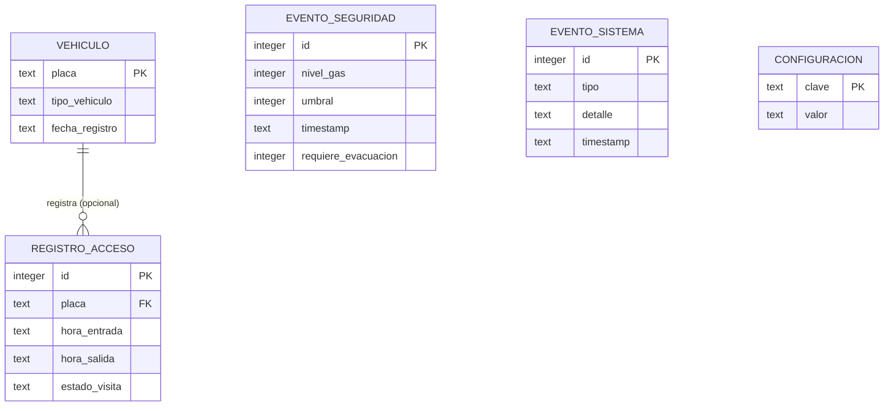

Mapeo JPA: cada entidad JPA mapea a su tabla y es distinta de la de dominio; se convierten con los mapeadores. Hibernate no gestiona el esquema (`ddl-auto: none`); las tablas las crea `schema.sql`. Con `CREATE TABLE IF NOT EXISTS` la inicialización es idempotente y no borra datos.

Recuperación tras reinicio: al arrancar se lee la capacidad y el umbral desde `configuracion`, se cuentan los registros activos para reconstruir los cupos ocupados y se restablece el estado. El conteo y el estado sobreviven a un corte de energía.

## 21. Configuración

`src/main/resources/application.yml`:

```yaml
server:
  port: 7070

spring:
  datasource:
    url: jdbc:sqlite:data/smartparking.db
    driver-class-name: org.sqlite.JDBC
    hikari:
      maximum-pool-size: 1                 # serializa las escrituras a SQLite
      connection-init-sql: PRAGMA journal_mode=WAL;
  jpa:
    hibernate:
      ddl-auto: none
    database-platform: org.hibernate.community.dialect.SQLiteDialect
  sql:
    init:
      mode: always
      schema-locations: classpath:db/schema.sql

smartparking:
  dispositivo:
    token: ${DISPOSITIVO_TOKEN:cambia-este-token}
    latido-timeout-ms: 5000
  seguridad:
    token-operador: ${OPERADOR_TOKEN:cambia-este-token}
```

La carpeta `data/` debe existir antes del primer arranque, o se ajusta la ruta del archivo. Los tokens se leen de variables de entorno (`DISPOSITIVO_TOKEN`, `OPERADOR_TOKEN`) para no subir credenciales al repositorio; los valores por defecto son solo para desarrollo local. El SSID y la contraseña del WiFi, y la dirección IP del backend, se configuran en el firmware, no en el backend.

## 22. Dependencias

Generar la base con Spring Initializr seleccionando Java 17, Maven y la última versión estable de Spring Boot 3.x, con los starters: Spring Web, Spring Data JPA, WebSocket y Validation. Luego agregar manualmente:

- `org.xerial:sqlite-jdbc`
- `org.hibernate.orm:hibernate-community-dialects` (dialecto de SQLite para Hibernate)

Las pruebas usan `spring-boot-starter-test` (incluye JUnit 5 y Mockito), que Spring Initializr añade por defecto. Verificar y usar las versiones estables más recientes al crear el proyecto. No se usa ninguna librería de comunicación serial: el enlace con el dispositivo es por WebSocket, que ya provee el starter de WebSocket.

## 23. Estrategia de pruebas

La arquitectura permite probar el núcleo sin hardware.

- Pruebas unitarias del dominio (JUnit puro, sin Spring): invariantes de `EstadoParqueadero`, transiciones de la barrera, `PoliticaAccesoPorDefecto`.
- Pruebas de los servicios de aplicación (JUnit y Mockito): con puertos simulados. Verifican que el ingreso descuenta cupo, ordena abrir y guarda el registro; que la salida suma cupo y cierra el registro; que superar el umbral activa alarma, registra evento y dispara la emergencia.
- Pruebas del codificador de mensajes: JSON a mensaje y mensaje a JSON.
- Pruebas de persistencia (`@DataJpaTest`): los adaptadores de repositorio contra una base SQLite temporal.
- Pruebas de la web (`@WebMvcTest`): los controladores con casos de uso simulados.
- Prueba de recuperación: con datos precargados, el arranque reconstruye el conteo correcto.

Meta sugerida: el núcleo (dominio y aplicación) por encima del 80 por ciento de cobertura.

## 24. Requisitos

Requerimientos funcionales:

| ID | Descripción | Prioridad |
|---|---|---|
| RF-01 | Detectar la llegada de un vehículo a la entrada. | Alta |
| RF-02 | Detectar la llegada de un vehículo a la salida. | Alta |
| RF-03 | Verificar que haya cupo antes de autorizar el ingreso. | Alta |
| RF-04 | Abrir la barrera de entrada si hay cupo. | Alta |
| RF-05 | Abrir la barrera de salida sin condicionar a cupos. | Alta |
| RF-06 | Cerrar la barrera tras el paso del vehículo. | Alta |
| RF-07 | Bloquear el ingreso cuando los cupos sean cero. | Alta |
| RF-08 | Confirmar el paso antes de cerrar la barrera. | Media |
| RF-09 | Mantener el conteo de cupos en tiempo real. | Alta |
| RF-10 | Descontar un cupo por ingreso. | Alta |
| RF-11 | Sumar un cupo por salida, sin exceder la capacidad. | Alta |
| RF-12 | Configurar la capacidad total sin rehacer el sistema. | Media |
| RF-13 | Mostrar los cupos en un indicador visible. | Alta |
| RF-14 | Conteo único y consistente. | Alta |
| RF-15 | Registrar cada ingreso con fecha y hora. | Alta |
| RF-16 | Registrar cada salida con fecha y hora. | Alta |
| RF-17 | Asociar cada salida con su ingreso. | Media |
| RF-18 | Consultar el histórico de accesos. | Media |
| RF-19 | Distinguir visitas activas de finalizadas. | Baja |
| RF-20 | Asociar un identificador de vehículo cuando esté disponible. | Baja |
| RF-21 | Monitorear humo o gas de forma continua. | Alta |
| RF-22 | Umbral de humo configurable. | Media |
| RF-23 | Activar alarma al superar el umbral. | Alta |
| RF-24 | Registrar cada evento de seguridad. | Media |
| RF-25 | Ejecutar el protocolo de emergencia. | Media |
| RF-26 | Reflejar el estado operativo. | Media |
| RF-27 | Bloquear y restablecer el ingreso. | Media |
| RF-28 | Control desde el dashboard: barreras, emergencia, configuración. | Alta |
| RF-29 | Reflejar en el dashboard los cambios en tiempo real. | Alta |
| RF-30 | Reconstruir el estado al iniciar desde la base de datos. | Alta |

Requerimientos no funcionales:

| ID | Descripción | Prioridad |
|---|---|---|
| RNF-01 | Apertura en menos de 2 segundos tras autorizar. | Alta |
| RNF-02 | Actualización del conteo con retraso mínimo. | Alta |
| RNF-03 | Alarma casi inmediata al superar el umbral. | Alta |
| RNF-04 | Conteo exacto, sin dobles conteos ni omisiones. | Alta |
| RNF-05 | Filtrar lecturas espurias de los sensores. | Alta |
| RNF-06 | Operar localmente ante pérdida de conexión. | Media |
| RNF-07 | Operación continua durante el horario. | Alta |
| RNF-08 | Recuperar conteo y estado tras reinicio. | Alta |
| RNF-09 | Favorecer siempre la condición segura. | Alta |
| RNF-10 | Información persistente e íntegra. | Alta |
| RNF-11 | Restringir configuración e historiales a personal autorizado. | Media |
| RNF-12 | Indicador de cupos legible a distancia. | Media |
| RNF-13 | Comprensión inmediata del estado. | Media |
| RNF-14 | Capacidad y umbral ajustables por configuración. | Media |
| RNF-15 | Sistema modular. | Media |
| RNF-16 | Consistencia del conteo central. | Media |
| RNF-17 | Robustez ante el entorno físico. | Baja |
| RNF-18 | La lógica de negocio reside en el backend. | Alta |
| RNF-19 | Modo seguro local del firmware. | Media |
| RNF-20 | Núcleo probable sin hardware. | Media |

## 25. Trazabilidad requisitos a diseño

| Requisito | Dónde se cumple |
|---|---|
| RF-01, RF-02 | Sensores IR y firmware; eventos por el enlace WebSocket. |
| RF-03, RF-07 | `PoliticaAccesoPorDefecto` y `EstadoParqueadero` en `RegistrarEntradaServicio`. |
| RF-04, RF-05, RF-06 | Comandos de apertura y cierre; máquina de estados de la barrera. |
| RF-08, RNF-09 | Confirmación de paso y transición segura de la barrera. |
| RF-09 a RF-11, RF-14, RNF-04 | `EstadoParqueadero` como única fuente de verdad. |
| RF-12, RF-22, RNF-14 | `ConfiguracionServicio` y `RepositorioConfiguracion`. |
| RF-13, RNF-12, RNF-13 | Panel del dashboard (y display I2C opcional). |
| RF-15 a RF-19 | `RegistroAcceso` y `RepositorioRegistroAcceso`. |
| RF-17 | `buscarActivoMasAntiguo` cierra el registro más antiguo al salir. |
| RF-20 | `Vehiculo` opcional. |
| RF-21, RF-23, RF-24 | `ProcesarLecturaHumoServicio` y `RepositorioEventoSeguridad`. |
| RF-25, RF-27 | `EjecutarEmergenciaServicio` y estado del sistema. |
| RF-26 | Estado en `GET /api/estado` y en el dashboard. |
| RF-28, RF-29 | Controladores REST y WebSocket del tablero. |
| RF-30, RNF-08 | `InicializadorEstado`. |
| RNF-05 | Antirrebote en el firmware. |
| RNF-06, RNF-19 | Modo seguro local del firmware. |
| RNF-10 | SQLite persistente detrás de los adaptadores. |
| RNF-11 | `InterceptorTokenOperador`. |
| RNF-15 | Arquitectura hexagonal y firmware modular. |
| RNF-16 | Conteo central único en el backend. |
| RNF-18, RNF-20 | Lógica en el backend; núcleo probable con puertos simulados. |

## 26. Diagramas UML

### 26.1 Componentes (hexagonal)

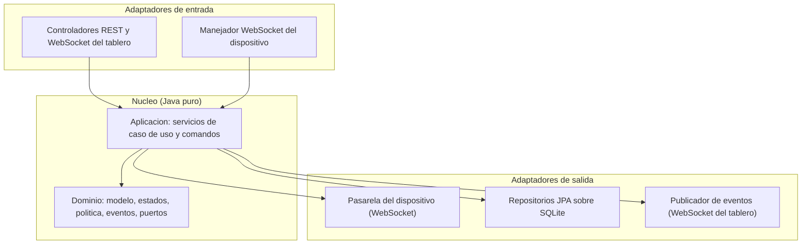

### 26.2 Clases del firmware (ESP32-C3)

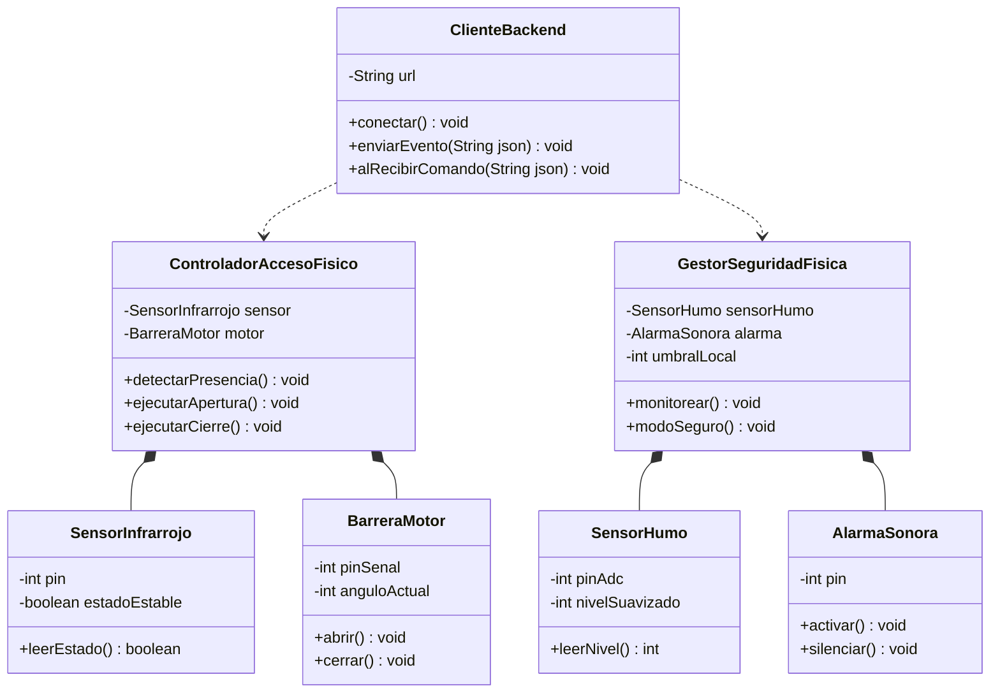

### 26.3 Clases del dominio

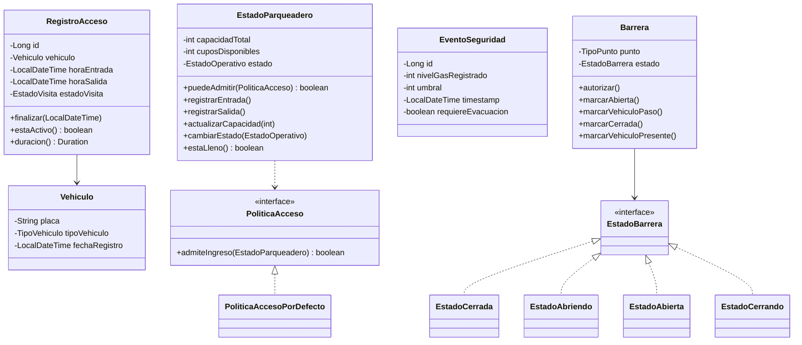

### 26.4 Clases de puertos y adaptadores

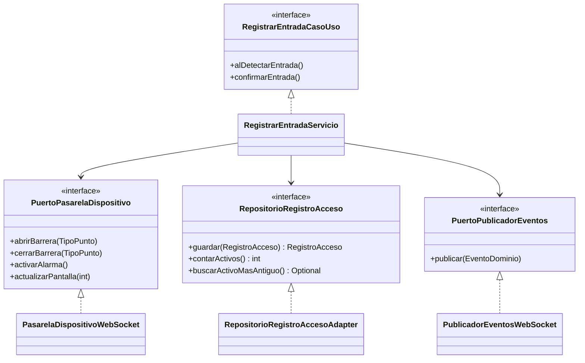

### 26.5 Clases de aplicación y comandos

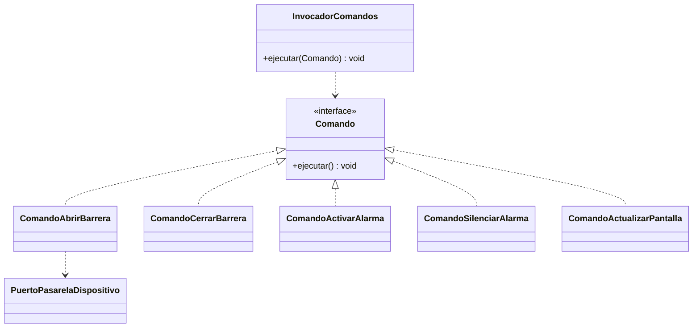

### 26.6 Clases de la capa web

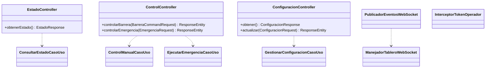

### 26.7 Secuencia: ingreso

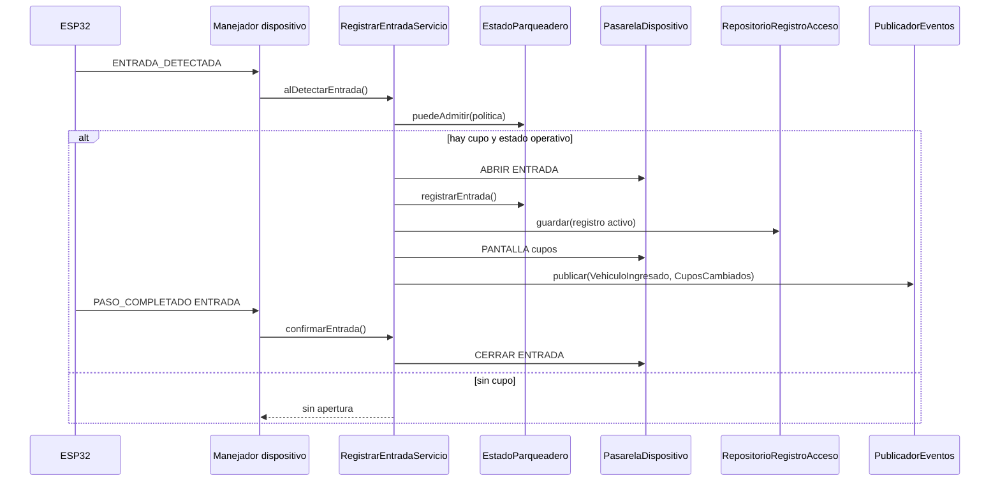

### 26.8 Secuencia: salida

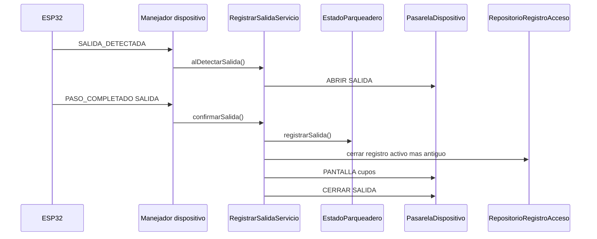

### 26.9 Secuencia: emergencia por humo

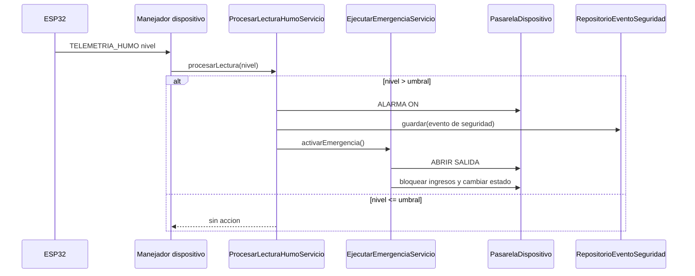

## 27. Instrucciones de implementación

Orden sugerido:

1. Generar el proyecto Spring Boot (Java 17, Maven) con las dependencias de la sección 22. Crear la estructura de paquetes de la sección 4 y colocar `schema.sql`, `application.yml` y la configuración de logs.
2. Implementar el dominio (sección 5), las máquinas de estado (sección 6), la política (sección 7) y los eventos (sección 8), con pruebas unitarias.
3. Definir los puertos de entrada y de salida (secciones 9 y 10).
4. Implementar los servicios de aplicación y los comandos (secciones 11 y 12), con pruebas.
5. Implementar la persistencia: entidades JPA, repositorios, adaptadores y mapeadores (sección 13.2), con pruebas.
6. Implementar el enlace con el dispositivo por WebSocket: pasarela, manejador y codificador (sección 13.1).
7. Implementar la configuración de beans y el inicializador de arranque (sección 13.3).
8. Implementar la capa web: controladores, DTOs, WebSocket del tablero, seguridad y manejo de errores (sección 14), con pruebas.
9. Implementar el frontend estático (sección 15).
10. Crear el firmware de la ESP32-C3 (sección 18) según la asignación de pines y las advertencias de la sección 19.

Convenciones:

- El dominio y la aplicación no deben contener anotaciones de Spring ni de JPA. Spring vive solo en los adaptadores y en el arranque.
- Nombres de clase en español sin tildes, como en este documento. Comentarios breves y en español, solo donde aporten.
- Compilar y correr las pruebas después de cada etapa; no avanzar con una etapa rota.
- Salida de consola limpia; nivel de log INFO por defecto.
- Reemplazar la estructura inicial del repositorio (creada para otra librería web y otra placa) por esta configuración.

## 28. Compilación y ejecución

Desde la carpeta del proyecto:

```bash
mvn clean package
java -jar target/smart-parking-lot.jar
```

El panel queda disponible en `http://localhost:7070`. La ESP32 debe estar en la misma red WiFi y apuntar a la IP del backend. Ajustar el SSID, la contraseña y la IP del backend en el firmware.

## 29. Limitaciones conocidas y riesgos aceptados

Estas limitaciones son propias del alcance de la maqueta. Se documentan y se aceptan; no se corrigen en esta versión.

- Emparejamiento por orden de llegada: sin reconocimiento de placas, una salida se asocia al registro activo más antiguo. Si un vehículo entra antes pero sale después que otro, las duraciones quedan cruzadas. Si el operador ingresa la placa manualmente, la salida puede emparejarse por esa placa.
- Un solo sensor por punto: el sensor no distingue "el vehículo pasó" de "el vehículo se devolvió", ya que ambos casos liberan el sensor. Puede producir un sobreconteo, que se corrige con la recalibración manual de cupos.
- Sin cifrado (ausencia de TLS): el tráfico entre el navegador, el backend y la ESP32 va en texto plano sobre HTTP y WebSocket. El token de operador viaja sin cifrar y es vulnerable en una red WiFi compartida. En el entorno local y académico se acepta este riesgo; en producción se usaría HTTPS y WSS.

## 30. Anexo: README del repositorio

Publicar este contenido, sin cambios, como `README.md` en la raíz del repositorio.

````markdown
# Smart Parking Lot

Sistema de gestión automatizada de un parqueadero, construido como maqueta a escala. Un dispositivo ESP32-C3 con sensores y actuadores controla el acceso, y un backend en Java con arquitectura hexagonal mantiene el conteo, la seguridad y el historial, con un panel web en tiempo real.


## Descripción

El sistema controla el acceso vehicular de forma automática, mantiene el conteo de cupos disponibles en tiempo real y vigila la presencia de humo o gas, activando una alarma cuando se supera un umbral configurable. La ESP32-C3 se comunica con el backend por WiFi mediante WebSocket; el backend concentra toda la lógica de negocio y sirve un panel web de control y monitoreo. Cada acceso y cada alerta quedan registrados de forma persistente.

## Características

- Detección automática de vehículos en entrada y salida.
- Control automático de barreras con cierre seguro.
- Conteo de cupos en tiempo real, único y persistente.
- Monitoreo continuo de humo con alarma y protocolo de emergencia.
- Panel web de control y monitoreo con actualización en vivo.
- Registro histórico de accesos y de eventos de seguridad.
- Capacidad y umbral configurables sin recompilar.

## Arquitectura

Arquitectura hexagonal (puertos y adaptadores). El dominio y la aplicación no dependen de Spring ni de la base de datos ni del dispositivo: se comunican con el exterior a través de puertos, y los adaptadores implementan esos puertos con tecnología concreta. La lógica de negocio reside en el backend; la ESP32 solo detecta, ejecuta y muestra.

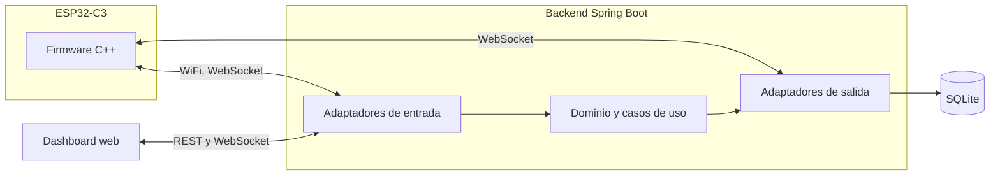

## Stack tecnológico

| Capa | Tecnología |
|---|---|
| Backend | Java 17, Spring Boot 3, Maven |
| Tiempo real y enlace con el dispositivo | Spring WebSocket |
| Persistencia | Spring Data JPA sobre SQLite |
| Frontend | HTML, CSS y JavaScript con Chart.js |
| Dispositivo | ESP32-C3 Super Mini (WiFi) |
| Firmware | C++ con el núcleo Arduino de ESP32 |

## Estructura del repositorio

```
smart-parking-lot/
├── docs/            Documentacion tecnica
├── firmware/        Firmware de la ESP32-C3 (C++)
├── hardware/        Lista de materiales y diagramas de conexion
└── host/            Backend en Java (proyecto Maven Spring Boot)
```

## Requisitos previos

- JDK 17 o superior
- Maven 3.9 o superior
- IDE de Arduino con soporte para ESP32 (o PlatformIO)
- Una ESP32-C3 con los sensores y actuadores descritos en `hardware/`

## Compilación y ejecución

Desde `host/`:

```bash
mvn clean package
java -jar target/smart-parking-lot.jar
```

El panel queda disponible en `http://localhost:7070`. La ESP32 debe estar en la misma red WiFi y apuntar a la IP del backend.

## Equipo

| Integrante | Código |
|---|---|
| Luis Miguel Bahamón González | 160005101 |
| Emerson Andrey Beltrán Álvarez | 160005103 |
| Juan Fernando Fernández Vega | 160005112 |
| Mario Alejandro Rey Reina | 160004833 |
| César Mauricio Pérez Santos | 160005130 |

Universidad de los Llanos — Ingeniería de Sistemas — Tecnologías Avanzadas.

## Licencia

Distribuido bajo la licencia MIT. Ver el archivo `LICENSE`.
````
