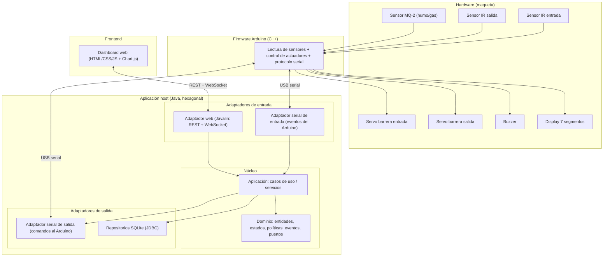
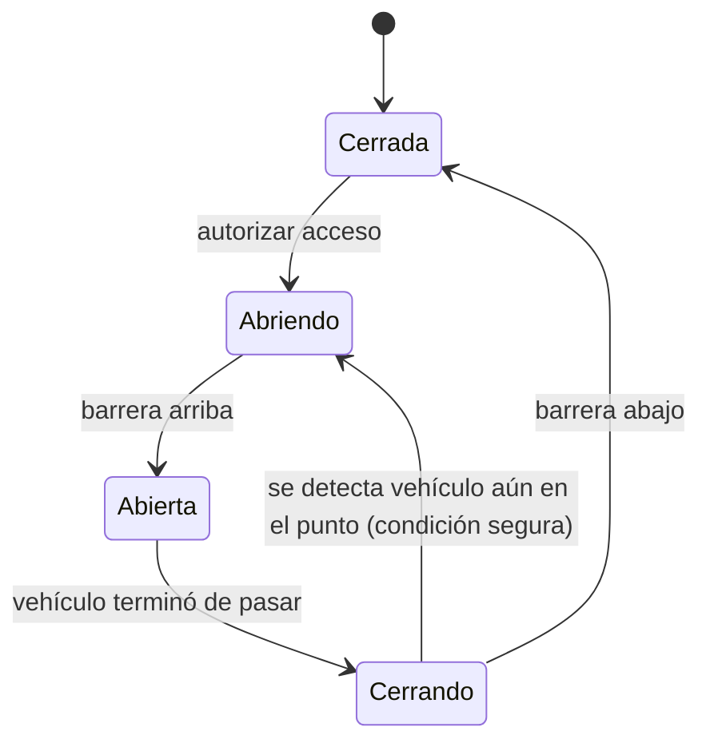
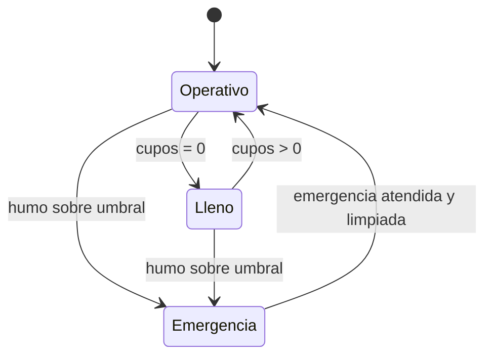
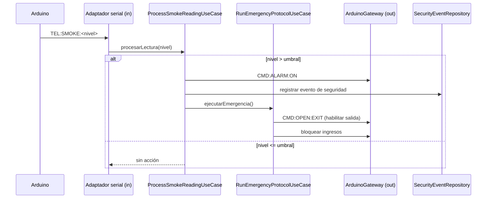
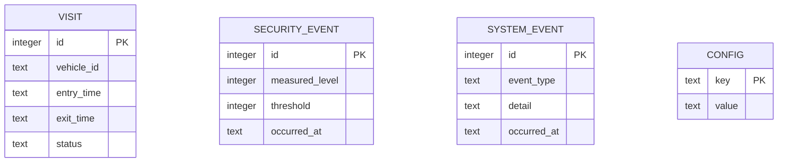

# Plan Técnico — Smart Parking Lot

**Curso:** Tecnologías Avanzadas
**Universidad:** Universidad de los Llanos (Unillanos)
**Tipo de entrega:** Proyecto final (maqueta física con Arduino + software de control y monitoreo)

**Integrantes:**

| Nombre | Código |
|---|---|
| Luis Miguel Bahamón González | 160005101 |
| Emerson Andrey Beltrán Álvarez | 160005103 |
| Juan Fernando Fernández Vega | 160005112 |
| Mario Alejandro Rey Reina | 160004833 |
| César Mauricio Pérez Santos | 160005130 |

**Landmark asignado para la maqueta:** [POR DEFINIR]. El tema de la maqueta no afecta la arquitectura de software; solo cambia la estética del modelo físico donde se montan los sensores y actuadores.

---

## Tabla de contenido

1. Objetivo y contexto
2. Alcance
3. Decisiones tecnológicas (stack)
4. Requerimientos
5. Arquitectura de software
6. Diseño del dominio
7. Flujos principales
8. Protocolo de comunicación serial (contrato Arduino ↔ host)
9. Firmware del Arduino
10. Hardware y montaje físico
11. Base de datos
12. Backend web
13. Frontend (dashboard)
14. Trazabilidad requisitos → diseño
15. Estrategia de pruebas
16. Organización del equipo y flujo de trabajo
17. Plan de trabajo por sprints
18. Riesgos y mitigaciones
19. Documentación a entregar
20. Guion de la presentación final
21. Supuestos y decisiones pendientes
22. Glosario

---

## 1. Objetivo y contexto

El proyecto consiste en construir una maqueta a escala de un parqueadero inteligente, instrumentada con sensores y actuadores conectados a un Arduino, monitoreada y controlada desde una aplicación de software. El propósito académico es demostrar diseño de software avanzado (SOLID, GRASP y patrones de diseño) integrado con un sistema físico real de sensado y control.

El sistema controla el acceso vehicular de forma automática, lleva el conteo de cupos disponibles en tiempo real y vigila condiciones de riesgo por humo o gas, activando una alarma cuando se supera un umbral configurable.

El énfasis de la calificación está en el diseño del software, no solo en que la maqueta funcione. Por eso la arquitectura se organiza para que las decisiones de diseño (dónde vive cada regla, cómo se desacopla el hardware, qué patrón resuelve qué problema) sean explícitas y defendibles.

## 2. Alcance

Dentro del alcance:

- Detección automática de vehículos en los puntos de entrada y salida.
- Control automático de las barreras de acceso.
- Cálculo y visualización de cupos disponibles en tiempo real.
- Registro histórico de eventos de entrada y salida.
- Monitoreo de humo o gas y activación de alarma ante condiciones de riesgo.
- Interfaz web de control y monitoreo (comando/control y visualización).
- Persistencia de accesos, eventos de seguridad y configuración.

Fuera del alcance:

- Cobro o facturación por tiempo de estadía.
- Reserva anticipada de cupos.
- Asignación de plazas individuales dentro del parqueadero.
- Reconocimiento de placas por visión artificial (el identificador de vehículo, si se usa, se ingresa de forma manual u opcional).

## 3. Decisiones tecnológicas (stack)

| Componente | Elección | Justificación |
|---|---|---|
| Lenguaje del software de control | Java 17 (LTS) | El curso evalúa diseño y patrones. GRASP nace del mundo Java/UML (Larman) y el tipado estático hace visibles las violaciones o el cumplimiento de SOLID. Núcleo en Java puro para que el diseño sea claramente del equipo y no del framework. |
| Herramienta de construcción | Maven | Estándar, ampliamente enseñado, manejo de dependencias claro y reproducible. |
| Arquitectura | Hexagonal (puertos y adaptadores) | Aísla el dominio del hardware y de la base de datos. Permite probar la lógica sin Arduino y agregar interfaces nuevas sin tocar el núcleo. Demuestra inversión de dependencias de forma directa. |
| Comunicación con Arduino | jSerialComm | Librería Java madura y multiplataforma para puerto serial (USB). Se usa dentro de un adaptador, detrás de un puerto del dominio. |
| Persistencia | SQLite + JDBC plano | Base de datos embebida, sin servidor, un solo archivo. Cumple recuperación tras reinicio e integridad. JDBC plano (sin JPA) mantiene el código simple y el patrón Repository a la vista. |
| Backend web | Javalin | Framework web ligero sobre Jetty, con WebSocket incluido. No invade la arquitectura: es solo un adaptador de entrada. Alternativa considerada: Spring Boot (más pesado y con más "magia" de inyección, que puede opacar la demostración manual de los patrones). |
| Serialización JSON | Jackson | Viene integrado con Javalin. |
| Frontend | HTML + CSS + JavaScript (vanilla) + Chart.js | Dashboard de una sola página, en tiempo real vía WebSocket. Sin cadena de build de Node, lo que reduce riesgo en un proyecto con hardware. Chart.js (por CDN) para gráficos del historial. |
| Registro de logs | SLF4J + Logback | Estándar de la industria, configuración mínima. |
| Pruebas | JUnit 5 + Mockito | Pruebas unitarias del dominio y aplicación, con dobles de prueba para los puertos (adaptador serial falso, repositorio en memoria). |
| Firmware | C++ (IDE de Arduino / PlatformIO) | Lenguaje nativo del Arduino Uno. |
| Control de versiones | Git + GitHub | Repositorio único, flujo por ramas de característica y Pull Requests. |

Nota sobre Javalin frente a Spring Boot: si el profesor prefiere ver Spring, el cambio afecta únicamente al adaptador web. El dominio y la aplicación quedan intactos. Ese hecho (poder cambiar la tecnología de entrega sin tocar la lógica) es en sí mismo una prueba de que la arquitectura hexagonal está bien aplicada, y conviene mencionarlo en la sustentación.

## 4. Requerimientos

Se conservan los identificadores del documento original (RF-NN y RNF-NN). Esta sección los consolida y añade requisitos derivados del diseño (marcados como "Nuevo").

### 4.1 Requerimientos funcionales

| ID | Descripción breve | Prioridad |
|---|---|---|
| RF-01 | Detectar automáticamente la llegada de un vehículo a la entrada. | Alta |
| RF-02 | Detectar automáticamente la llegada de un vehículo a la salida. | Alta |
| RF-03 | Verificar que haya al menos un cupo antes de autorizar el ingreso. | Alta |
| RF-04 | Abrir automáticamente la barrera de entrada si hay cupo. | Alta |
| RF-05 | Abrir automáticamente la barrera de salida (sin condicionar a cupos). | Alta |
| RF-06 | Cerrar automáticamente la barrera tras el paso del vehículo. | Alta |
| RF-07 | Bloquear el ingreso cuando los cupos disponibles sean cero. | Alta |
| RF-08 | Confirmar que el vehículo terminó de pasar antes de cerrar la barrera. | Media |
| RF-09 | Mantener el conteo de cupos disponibles en tiempo real. | Alta |
| RF-10 | Descontar un cupo por cada ingreso. | Alta |
| RF-11 | Sumar un cupo por cada salida, sin exceder la capacidad total. | Alta |
| RF-12 | Configurar la capacidad total sin rehacer el sistema. | Media |
| RF-13 | Mostrar los cupos disponibles en un indicador visible (display físico). | Alta |
| RF-14 | Mantener un conteo único y consistente entre todos los puntos de acceso. | Alta |
| RF-15 | Registrar cada ingreso con fecha y hora. | Alta |
| RF-16 | Registrar cada salida con fecha y hora. | Alta |
| RF-17 | Asociar cada salida con su ingreso para conformar una visita. | Media |
| RF-18 | Permitir consultar el histórico de entradas y salidas. | Media |
| RF-19 | Distinguir visitas activas de visitas finalizadas. | Baja |
| RF-20 | Asociar un identificador de vehículo cuando esté disponible. | Baja (opcional) |
| RF-21 | Monitorear de forma continua la presencia de humo o gas. | Alta |
| RF-22 | Definir un umbral configurable de humo o gas. | Media |
| RF-23 | Activar una alarma sonora al superar el umbral. | Alta |
| RF-24 | Registrar cada evento de seguridad con nivel y marca de tiempo. | Media |
| RF-25 | Ejecutar un protocolo de emergencia (habilitar salida, bloquear ingresos). | Media |
| RF-26 | Reflejar en todo momento el estado operativo (operativo o bloqueado). | Media |
| RF-27 | Bloquear y restablecer el ingreso según estado o emergencia. | Media |

Requisitos funcionales nuevos derivados del diseño:

| ID | Descripción breve | Prioridad |
|---|---|---|
| RF-28 (Nuevo) | El dashboard web debe permitir comando y control: abrir/cerrar barreras manualmente, forzar y limpiar la emergencia, cambiar configuración. | Alta |
| RF-29 (Nuevo) | El dashboard debe reflejar en tiempo real los cambios de cupos, estado y eventos mediante WebSocket. | Alta |
| RF-30 (Nuevo) | El sistema debe reconstruir el estado (cupos, visitas activas, estado operativo) al iniciar, leyéndolo de la base de datos. | Alta |

### 4.2 Requerimientos no funcionales

| ID | Descripción breve | Prioridad |
|---|---|---|
| RNF-01 | La barrera debe comenzar a abrir en menos de 2 segundos tras autorizar el acceso. | Alta |
| RNF-02 | El indicador de cupos debe actualizarse con retraso mínimo tras cada ingreso o salida. | Alta |
| RNF-03 | La alarma debe activarse casi de inmediato al superar el umbral. | Alta |
| RNF-04 | El conteo de cupos debe ser exacto, sin dobles conteos ni omisiones. | Alta |
| RNF-05 | Filtrar lecturas repetidas o inestables de los sensores. | Alta |
| RNF-06 | Tolerar pérdidas temporales de comunicación operando localmente y sincronizando al reconectar. | Media |
| RNF-07 | Operar de forma continua durante el horario de funcionamiento. | Alta |
| RNF-08 | Recuperar conteo y estado tras reinicio o corte de energía. | Alta |
| RNF-09 | Favorecer siempre la condición segura: no cerrar la barrera en caso de duda. | Alta |
| RNF-10 | Conservar la información de forma persistente e íntegra. | Alta |
| RNF-11 | Restringir consulta y modificación de configuración e historiales a personal autorizado. | Media |
| RNF-12 | El indicador de cupos debe ser legible a distancia. | Media |
| RNF-13 | El usuario debe entender de inmediato si puede ingresar. | Media |
| RNF-14 | La capacidad y el umbral deben ajustarse por configuración, sin reingeniería. | Media |
| RNF-15 | El sistema debe organizarse en partes independientes. | Media |
| RNF-16 | Soportar múltiples puntos de acceso sin comprometer el conteo central. | Media |
| RNF-17 | Los elementos expuestos deben tolerar polvo, temperatura y vibración normales. | Baja |

Requisitos no funcionales nuevos:

| ID | Descripción breve | Prioridad |
|---|---|---|
| RNF-18 (Nuevo) | La lógica de negocio (conteo, autorización, protocolo de emergencia) reside en el host, no en el firmware, para asegurar consistencia y persistencia. | Alta |
| RNF-19 (Nuevo) | El firmware debe tener un modo seguro local: si pierde comunicación con el host por más de N segundos, mantiene entradas cerradas, permite salida y sostiene la alarma si detecta humo. | Media |
| RNF-20 (Nuevo) | El núcleo del sistema debe ser probable sin hardware, mediante un adaptador serial falso. | Media |

Sobre RNF-06 y RNF-19: existe una tensión entre "toda la lógica en el host" (consistencia, persistencia) y "seguir operando localmente si se cae la comunicación". Se resuelve con un modo seguro mínimo en el firmware. No duplica la lógica completa; solo garantiza una condición segura mientras no hay host. Es una decisión consciente que conviene explicar en la sustentación.

## 5. Arquitectura de software

### 5.1 Estilo arquitectónico

Se usa arquitectura hexagonal (puertos y adaptadores). El dominio y los casos de uso son el centro y no conocen ni el Arduino ni la base de datos ni la web. Se comunican con el exterior a través de puertos (interfaces). Los adaptadores implementan esos puertos con tecnología concreta.

Regla de dependencias: las dependencias apuntan hacia adentro. La infraestructura depende del dominio; el dominio no depende de nadie. Esto es exactamente el Principio de Inversión de Dependencias (la D de SOLID) hecho estructura.

### 5.2 Diagrama de componentes



### 5.3 Capas y responsabilidades

- Dominio: reglas del negocio puras. Entidades (ParkingLot, Spot, Visit, SecurityEvent), objetos de valor, eventos de dominio, máquinas de estado y políticas. Define los puertos (interfaces) que necesita del exterior. No importa ninguna librería de infraestructura.
- Aplicación: orquesta los casos de uso (registrar ingreso, registrar salida, procesar humo, ejecutar emergencia, cambiar configuración). Coordina el dominio con los puertos de salida. Es el punto de entrada lógico para los adaptadores.
- Infraestructura (adaptadores de salida): implementaciones concretas de los puertos. Adaptador serial (jSerialComm) y repositorios (SQLite/JDBC), configuración, logging.
- Interfaces (adaptadores de entrada): la web (Javalin) y el lector serial que traduce mensajes del Arduino en llamadas a casos de uso.

### 5.4 Estructura de paquetes

```
com.unillanos.smartparking
├── Main.java                      (composition root: arma el grafo de objetos)
├── domain
│   ├── model                      (ParkingLot, Spot, Visit, SecurityEvent, VehicleId, ...)
│   ├── state                      (estados de barrera y de sistema)
│   ├── policy                     (AccessPolicy y variantes: Strategy)
│   ├── event                      (eventos de dominio)
│   └── port
│       ├── in                     (interfaces de casos de uso)
│       └── out                    (ArduinoGatewayPort, VisitRepositoryPort, ...)
├── application
│   ├── usecase                    (implementaciones de los casos de uso)
│   └── command                    (objetos Command de control)
├── infrastructure
│   ├── serial                     (SerialArduinoGateway con jSerialComm, parser del protocolo)
│   ├── persistence                (repositorios JDBC/SQLite, DDL, mapeos)
│   ├── config                     (carga de configuración)
│   └── logging
└── interfaces
    └── web                        (controladores Javalin, WebSocket, archivos estáticos del dashboard)
```

### 5.5 Puertos (interfaces)

Puertos de entrada (lo que el sistema ofrece):

- `RegisterEntryUseCase`
- `RegisterExitUseCase`
- `ProcessSmokeReadingUseCase`
- `RunEmergencyProtocolUseCase`
- `UpdateConfigurationUseCase`
- `QueryStatusUseCase`
- `QueryHistoryUseCase`

Puertos de salida (lo que el sistema necesita del exterior):

- `ArduinoGatewayPort` (abrir/cerrar barrera, activar/silenciar alarma, actualizar display)
- `VisitRepositoryPort`
- `SecurityEventRepositoryPort`
- `ConfigurationRepositoryPort`
- `EventPublisherPort` (para empujar cambios al dashboard vía WebSocket)

### 5.6 Patrones de diseño aplicados

Cada patrón responde a un problema real del sistema. No se fuerza ningún patrón por cumplir cuota.

| Patrón | Dónde | Problema que resuelve | SOLID / GRASP |
|---|---|---|---|
| Adapter | `SerialArduinoGateway` implementa `ArduinoGatewayPort` sobre jSerialComm | Aislar la tecnología serial detrás de una interfaz del dominio; evitar que la librería contamine el núcleo. | DIP; Protección ante variaciones, Indirección |
| Repository | `VisitRepository`, `SecurityEventRepository`, `ConfigurationRepository` | Abstraer el acceso a datos; poder cambiar SQLite o probar en memoria. | DIP, SRP; Protección ante variaciones |
| State | Estado de la barrera (Cerrada, Abriendo, Abierta, Cerrando) y estado del sistema (Operativo, Lleno, Emergencia) | Eliminar condicionales dispersos; cada estado sabe qué transiciones permite. | OCP; No hardcodear condicionales |
| Observer | Publicación de eventos de dominio y empuje al dashboard (`EventPublisherPort`) | Desacoplar quién genera un evento de quién reacciona a él. | Bajo acoplamiento, Indirección |
| Command | Acciones de control (AbrirBarrera, CerrarBarrera, ActivarAlarma, EjecutarEmergencia) | Encapsular acciones como objetos; permitir registrarlas, encolarlas y reusarlas desde web o desde reacciones internas. | Bajo acoplamiento; Controlador |
| Strategy | `AccessPolicy` (autorizar si hay cupo; variantes futuras como cupos reservados) | Cambiar la regla de autorización sin tocar el caso de uso. | OCP |
| Facade / Application Service | Los servicios de aplicación son la fachada del núcleo hacia los adaptadores | Ofrecer una entrada limpia y única para la web y el lector serial. | Controlador, Bajo acoplamiento |
| Factory Method | Construcción de objetos de estado y de comandos; ensamblaje en el composition root | Centralizar la creación y ocultar detalles de construcción. | Creador |

Nota deliberada sobre Singleton: se evita el Singleton clásico (instancia estática global) porque suele convertirse en un acoplamiento oculto y dificulta las pruebas. En su lugar, los recursos que deben existir una sola vez (conexión serial, conexión a la base de datos, configuración) se crean una vez en el composition root (`Main`) y se inyectan por constructor a quien los necesite. El efecto es el mismo (una sola instancia) pero sin las desventajas del Singleton. Mencionar esta decisión demuestra criterio, no desconocimiento del patrón.

### 5.7 Principios SOLID en el diseño

- S (Responsabilidad única): cada caso de uso hace una cosa; los repositorios solo persisten; los adaptadores solo traducen.
- O (Abierto/cerrado): nuevas políticas de acceso o nuevos adaptadores no obligan a modificar el núcleo.
- L (Sustitución de Liskov): cualquier implementación de un puerto (real o de prueba) es intercambiable.
- I (Segregación de interfaces): puertos pequeños y específicos en lugar de una interfaz gigante.
- D (Inversión de dependencias): el dominio depende de abstracciones (puertos); las implementaciones concretas dependen del dominio.

## 6. Diseño del dominio

### 6.1 Entidades y objetos de valor

- `ParkingLot`: agrega el estado global. Conoce la capacidad total, los cupos disponibles y el estado operativo. Es el guardián de la invariante "0 ≤ cupos disponibles ≤ capacidad" (RF-11, RNF-04).
- `Spot`: representación lógica del cupo. Para este alcance basta el conteo agregado; no se asignan plazas individuales.
- `Visit`: par entrada-salida. Atributos: identificador, identificador de vehículo (opcional), hora de entrada, hora de salida, estado (ACTIVA o FINALIZADA). Cubre RF-15 a RF-19.
- `SecurityEvent`: evento de humo/gas con nivel medido, umbral vigente y marca de tiempo (RF-24).
- `VehicleId`: objeto de valor opcional (RF-20).
- `AccessPoint`: identifica un punto de acceso (entrada o salida). Permite escalar a varios puntos manteniendo un único conteo central (RF-14, RNF-16).

### 6.2 Máquina de estados de la barrera



La transición de "Cerrando" de vuelta a "Abriendo" cuando el sensor sigue detectando presencia implementa RNF-09 (no cerrar en caso de duda) y RF-08 (confirmar paso antes de cerrar).

### 6.3 Estado operativo del sistema



En estado Lleno se bloquea la apertura de la barrera de entrada (RF-07) pero la salida sigue disponible (RF-05). En Emergencia se ejecuta el protocolo: habilitar salida, bloquear ingresos, sostener la alarma (RF-25).

## 7. Flujos principales

### 7.1 Ingreso de un vehículo

```mermaid
sequenceDiagram
    participant AR as Arduino
    participant SI as Adaptador serial (in)
    participant UC as RegisterEntryUseCase
    participant PL as ParkingLot
    participant AG as ArduinoGateway (out)
    participant RE as VisitRepository

    AR->>SI: EVT:ENTRY_DETECTED
    SI->>UC: registrarIngreso(entrada)
    UC->>PL: hayCupo?
    alt hay cupo
        PL-->>UC: sí
        UC->>AG: CMD:OPEN:ENTRY
        UC->>PL: descontarCupo()
        UC->>RE: guardar visita ACTIVA
        UC->>AG: CMD:DISPLAY:<cupos>
        Note over AR: el vehículo pasa; el sensor se libera
        AR->>SI: EVT:VEHICLE_PASSED:ENTRY
        SI->>UC: confirmarPaso(entrada)
        UC->>AG: CMD:CLOSE:ENTRY
    else sin cupo
        PL-->>UC: no
        UC->>AG: (no abrir) mantener en espera
    end
```

### 7.2 Salida de un vehículo

Análogo al ingreso, pero la apertura no está condicionada a cupos. Al confirmar el paso, se suma un cupo (sin exceder la capacidad), se cierra la visita asociada (RF-17), se marca como FINALIZADA (RF-19) y se actualiza el display.

### 7.3 Detección de humo o gas



## 8. Protocolo de comunicación serial (contrato Arduino ↔ host)

La comunicación es por líneas de texto terminadas en salto de línea (`\n`), a 9600 o 115200 baudios. El texto plano facilita depurar con el monitor serial y desacopla firmware y host. Este contrato es la frontera formal entre hardware y software.

### 8.1 Mensajes del Arduino hacia el host (eventos y telemetría)

| Mensaje | Significado |
|---|---|
| `EVT:ENTRY_DETECTED` | Vehículo presente en la entrada. |
| `EVT:EXIT_DETECTED` | Vehículo presente en la salida. |
| `EVT:VEHICLE_PASSED:ENTRY` | El vehículo terminó de pasar por la entrada. |
| `EVT:VEHICLE_PASSED:EXIT` | El vehículo terminó de pasar por la salida. |
| `TEL:SMOKE:<n>` | Lectura analógica del sensor de humo (0 a 1023). |
| `EVT:READY` | El firmware terminó de iniciar y está listo. |
| `EVT:HEARTBEAT` | Señal periódica de vida del firmware. |

### 8.2 Mensajes del host hacia el Arduino (comandos)

| Mensaje | Acción |
|---|---|
| `CMD:OPEN:ENTRY` | Abrir barrera de entrada. |
| `CMD:CLOSE:ENTRY` | Cerrar barrera de entrada. |
| `CMD:OPEN:EXIT` | Abrir barrera de salida. |
| `CMD:CLOSE:EXIT` | Cerrar barrera de salida. |
| `CMD:ALARM:ON` | Activar alarma sonora. |
| `CMD:ALARM:OFF` | Silenciar alarma. |
| `CMD:DISPLAY:<n>` | Mostrar el número de cupos en el display. |
| `CMD:CONFIG:THRESHOLD:<n>` | Fijar el umbral de humo en el firmware. |
| `CMD:PING` | Solicitar un heartbeat inmediato. |

### 8.3 Reglas del protocolo

- El host es la autoridad de negocio: decide cuándo abrir, cerrar o alarmar. El firmware ejecuta y reporta.
- El firmware nunca calcula cupos ni decide autorizaciones (RNF-18). Solo detecta, ejecuta y muestra lo que el host le indica.
- El firmware confirma el fin del paso (EVT:VEHICLE_PASSED) solo cuando el sensor queda liberado de forma estable, tras un tiempo de rebote (RNF-05, RF-08).
- Si el firmware no recibe comandos ni PING por más de N segundos, entra en modo seguro (RNF-19).

## 9. Firmware del Arduino

### 9.1 Responsabilidades

- Leer los dos sensores IR (entrada y salida) con antirrebote (debounce) para no generar dobles eventos (RNF-05).
- Leer el sensor MQ-2 por entrada analógica y enviarlo periódicamente como telemetría.
- Mover los servos de las barreras al recibir comandos.
- Encender o apagar el buzzer al recibir comandos.
- Actualizar el display de 7 segmentos con el número que envíe el host.
- Enviar heartbeat periódico y aplicar modo seguro ante ausencia de host.

### 9.2 Estructura del programa

El firmware es no bloqueante: nada de `delay()` largos. Se usa el patrón de tiempo con `millis()` para el muestreo del MQ-2, el heartbeat, el antirrebote y el control de los servos. El bucle principal lee sensores, procesa comandos entrantes y atiende temporizadores.

Bosquejo de organización (archivos):

```
firmware/
├── smart_parking.ino        (setup + loop)
├── SerialProtocol.h/.cpp    (parseo de comandos y armado de eventos)
├── Barrier.h/.cpp           (control de un servo con estados: abierta/cerrada)
├── SmokeSensor.h/.cpp       (lectura y suavizado del MQ-2)
├── VehicleSensor.h/.cpp     (lectura IR con antirrebote)
└── Display7Seg.h/.cpp       (mapa de dígitos a segmentos)
```

Aunque el firmware es sencillo, mantener estas clases separadas también refleja modularidad (RNF-15) y da coherencia con el diseño del host.

### 9.3 Consideraciones importantes

- El MQ-2 requiere un tiempo de precalentamiento (preheat) tras energizar antes de dar lecturas estables. El firmware puede esperar y anunciar `EVT:READY` cuando el sensor esté listo.
- El umbral de humo se aplica en el host (para poder configurarlo y registrarlo), pero el firmware guarda una copia recibida por `CMD:CONFIG:THRESHOLD` para el modo seguro.
- El antirrebote de los sensores IR evita que un mismo vehículo genere varios eventos (RNF-05, RNF-04).

## 10. Hardware y montaje físico

### 10.1 Lista de materiales

| Componente | Cantidad | Notas |
|---|---|---|
| Arduino Uno | 1 | Placa principal. |
| Sensor IR de obstáculo | 2 | Detección de vehículo en entrada y salida. |
| Sensor MQ-2 | 1 | Humo, gas licuado, propano. Salida analógica. |
| Servomotor (SG90 o similar) | 2 | Barreras de entrada y salida. |
| Buzzer | 1 | Alarma sonora. Activo (más simple) o pasivo (usar tone()). |
| Display de 7 segmentos | 1 | Suelto. Indicador de cupos. |
| Fuente externa 5V | 1 | Alimentar los servos aparte del Arduino. |
| Resistencias | varias | Una por segmento del display; según sensores. |
| Protoboard y cables jumper | — | Montaje. |
| Registro 74HC595 | 0 a 2 (opcional) | Solo si se usa display de 2 dígitos (ver 10.4). |

### 10.2 Alimentación

Los servos generan picos de corriente que pueden reiniciar el Arduino si se alimentan desde el pin de 5V de la placa. Por eso los servos se alimentan desde la fuente externa de 5V. La tierra de la fuente externa debe unirse a la tierra del Arduino (tierra común); si no, los servos no responden bien.

### 10.3 Asignación de pines (configuración por defecto: display de 1 dígito, hasta 9 cupos)

Los pines 0 y 1 se reservan para la comunicación USB con el host y no se usan para nada más.

| Pin | Conexión |
|---|---|
| D2 | Sensor IR entrada (señal) |
| D3 | Sensor IR salida (señal) |
| D4 | Buzzer |
| D5 | Servo barrera entrada (señal) |
| D6 | Servo barrera salida (señal) |
| D7 | Display segmento a |
| D8 | Display segmento b |
| D9 | Display segmento c |
| D10 | Display segmento d |
| D11 | Display segmento e |
| D12 | Display segmento f |
| D13 | Display segmento g |
| A0 | Sensor MQ-2 (salida analógica) |

Con un solo dígito conectado directo no hay multiplexación, así que no hay parpadeo ni conflicto de temporización con los servos. Los pines A1 a A5 quedan libres para ampliaciones.

Nota sobre servos y pines 9 y 10: la librería Servo usa un temporizador que deshabilita la salida PWM (analogWrite) en los pines 9 y 10, pero la escritura digital sigue funcionando. Aquí los pines 9 y 10 se usan como salidas digitales para segmentos del display, así que no hay conflicto.

### 10.4 Ampliación a display de 2 dígitos (hasta 99 cupos)

Si la maqueta va a tener 10 o más cupos, se necesita un display de 2 dígitos. La opción limpia es usar registros de desplazamiento 74HC595 en cadena (dos, uno por dígito), que controlan ambos dígitos de forma estática con solo 3 pines (datos, reloj, latch). Esto evita la multiplexación por software y su parpadeo, y libera pines. En ese caso, la asignación de segmentos de la tabla anterior se reemplaza por tres pines para el 74HC595, y los sensores y actuadores conservan sus pines.

Recomendación: definir cuántos cupos tendrá la maqueta antes del montaje. Con 9 o menos, no se requieren piezas adicionales.

## 11. Base de datos

SQLite en un archivo local. Fechas en formato ISO-8601 (texto). El acceso va detrás del patrón Repository.

### 11.1 Modelo



### 11.2 Esquema (DDL)

```sql
CREATE TABLE IF NOT EXISTS config (
    key   TEXT PRIMARY KEY,
    value TEXT NOT NULL
);
-- Valores iniciales: total_capacity, smoke_threshold, system_state

CREATE TABLE IF NOT EXISTS visit (
    id         INTEGER PRIMARY KEY AUTOINCREMENT,
    vehicle_id TEXT,
    entry_time TEXT NOT NULL,
    exit_time  TEXT,
    status     TEXT NOT NULL DEFAULT 'ACTIVE'
);

CREATE TABLE IF NOT EXISTS security_event (
    id             INTEGER PRIMARY KEY AUTOINCREMENT,
    measured_level INTEGER NOT NULL,
    threshold      INTEGER NOT NULL,
    occurred_at    TEXT NOT NULL
);

CREATE TABLE IF NOT EXISTS system_event (
    id          INTEGER PRIMARY KEY AUTOINCREMENT,
    event_type  TEXT NOT NULL,
    detail      TEXT,
    occurred_at TEXT NOT NULL
);
```

### 11.3 Recuperación tras reinicio (RNF-08, RF-30)

Al iniciar, la aplicación lee la capacidad y el umbral de `config`, cuenta las visitas ACTIVAS para reconstruir los cupos ocupados (cupos disponibles = capacidad − visitas activas) y restablece el estado operativo. Así el conteo sobrevive a un corte de energía sin perder información.

## 12. Backend web

Javalin sirve el API y los archivos estáticos del dashboard, y mantiene la conexión WebSocket para tiempo real.

### 12.1 Endpoints REST

| Método y ruta | Función | Acceso |
|---|---|---|
| `GET /api/status` | Cupos disponibles, capacidad, estado operativo, estado de alarma. | Lectura |
| `GET /api/visits` | Historial de visitas, con filtros por fecha y por estado. | Lectura |
| `GET /api/events/security` | Historial de eventos de humo/gas. | Lectura |
| `GET /api/config` | Configuración actual (capacidad, umbral). | Lectura |
| `POST /api/config` | Actualizar capacidad o umbral. | Operador |
| `POST /api/control/barrier` | Abrir o cerrar una barrera manualmente. | Operador |
| `POST /api/control/emergency` | Forzar o limpiar la emergencia. | Operador |

### 12.2 Tiempo real (WebSocket)

El canal `/ws` empuja al dashboard: cambios de cupos, cambios de estado operativo, alarma encendida o apagada, nuevas visitas y nuevos eventos de seguridad. El dominio publica estos eventos a través de `EventPublisherPort`, cuyo adaptador es el manejador WebSocket. Así el dominio no sabe nada de WebSocket (Observer + puerto de salida).

### 12.3 Control de acceso (RNF-11)

Los endpoints de lectura pueden quedar abiertos en la red local; los de control y configuración exigen autorización. Para el alcance del curso basta un esquema simple: un token de operador enviado en la cabecera de la petición, con dos roles (visor y operador). Es una protección mínima pero suficiente para demostrar el requisito; en el documento se deja claro que en producción se usaría un mecanismo más robusto.

## 13. Frontend (dashboard)

Una sola página, sin cadena de build, servida como archivos estáticos por Javalin.

Vistas:

- Panel principal: cupos disponibles en grande, capacidad total, estado operativo (Operativo / Lleno / Emergencia) e indicador de alarma. Se actualiza en vivo por WebSocket (RF-29).
- Controles de operador: botones para abrir/cerrar barreras, forzar y limpiar emergencia, y un formulario para cambiar capacidad y umbral (RF-28). Visibles solo con token de operador.
- Historial: tabla de visitas (entrada, salida, estado, duración) y tabla de eventos de seguridad, con filtros por fecha (RF-18, RF-24).
- Analítica: gráficos con Chart.js (ingresos por hora, ocupación en el tiempo, eventos de seguridad).

Tecnologías: HTML, CSS y JavaScript sin framework; Chart.js por CDN; cliente WebSocket nativo del navegador. El estilo debe priorizar la legibilidad del número de cupos a distancia, en coherencia con RNF-12 y RNF-13.

## 14. Trazabilidad requisitos → diseño

| Requisito | Dónde se cumple |
|---|---|
| RF-01, RF-02 | Sensores IR + firmware; eventos EVT:ENTRY/EXIT_DETECTED. |
| RF-03, RF-07 | AccessPolicy (Strategy) + ParkingLot en RegisterEntryUseCase. |
| RF-04, RF-05, RF-06 | Comandos OPEN/CLOSE vía ArduinoGateway; máquina de estados de barrera. |
| RF-08, RNF-09 | Confirmación EVT:VEHICLE_PASSED + transición segura de la barrera. |
| RF-09 a RF-11, RF-14, RNF-04 | ParkingLot como única fuente de verdad del conteo. |
| RF-12, RF-22, RNF-14 | ConfigurationRepository + endpoint POST /api/config. |
| RF-13, RNF-12, RNF-13 | Display de 7 segmentos + panel del dashboard. |
| RF-15 a RF-19 | Visit + VisitRepository. |
| RF-20 | VehicleId opcional en Visit. |
| RF-21, RF-23, RF-24 | SmokeSensor + ProcessSmokeReadingUseCase + SecurityEventRepository. |
| RF-25, RF-27 | RunEmergencyProtocolUseCase + estado de sistema. |
| RF-26 | Estado operativo expuesto en /api/status y en el dashboard. |
| RF-28, RF-29 | Adaptador web (Javalin) + WebSocket. |
| RF-30, RNF-08 | Reconstrucción de estado al iniciar desde SQLite. |
| RNF-05 | Antirrebote en el firmware. |
| RNF-06, RNF-19 | Modo seguro local del firmware. |
| RNF-10 | SQLite persistente detrás de Repository. |
| RNF-11 | Autorización por token en endpoints de control. |
| RNF-15 | Arquitectura hexagonal por capas y firmware modular. |
| RNF-16 | AccessPoint + conteo central único. |
| RNF-18, RNF-20 | Lógica en el host; núcleo probable con adaptador serial falso. |

## 15. Estrategia de pruebas

La arquitectura hexagonal permite probar el núcleo sin hardware, lo cual es un punto fuerte para mostrar en la sustentación.

- Pruebas unitarias del dominio (JUnit 5): invariantes de ParkingLot (no bajar de 0 ni pasar de la capacidad), transiciones de la máquina de estados, políticas de acceso.
- Pruebas de casos de uso (JUnit 5 + Mockito): se simulan los puertos de salida (ArduinoGateway falso, repositorios en memoria) y se verifica que el ingreso descuenta cupo, abre la barrera y guarda la visita; que la salida suma cupo y cierra la visita; que superar el umbral dispara alarma, registra evento y ejecuta emergencia.
- Pruebas del parser del protocolo serial: dado un texto de entrada, se produce el evento correcto, y viceversa.
- Prueba de recuperación: con datos precargados en SQLite, la aplicación reconstruye el conteo correcto al iniciar.
- Pruebas manuales de integración con la maqueta: recorrido completo entrada-salida, lleno, y simulación de humo (con un encendedor o humo controlado, con cuidado).

Meta de cobertura sugerida: el núcleo (dominio y aplicación) por encima del 80 por ciento. Los adaptadores se prueban de forma más ligera.

## 16. Organización del equipo y flujo de trabajo

### 16.1 Roles propuestos

Distribución por afinidad con las capas. Cada quien prueba y documenta su parte; la integración se hace en parejas. Ajustable según preferencias del equipo.

| Integrante | Responsabilidad principal |
|---|---|
| Luis Miguel Bahamón | Arquitectura, núcleo de dominio y aplicación (patrones, casos de uso), coordinación de integración. |
| Emerson Andrey Beltrán | Infraestructura: adaptador serial (jSerialComm) y persistencia (JDBC/SQLite). |
| Juan Fernando Fernández | Firmware del Arduino y lado embebido del protocolo serial. |
| Mario Alejandro Rey | Hardware y maqueta: sensores, actuadores, cableado, energía, integración física. |
| César Mauricio Pérez | Backend web (Javalin, REST, WebSocket) y frontend (dashboard). |

Responsabilidades transversales de todo el equipo: pruebas de su módulo, documentación, y participación en la sustentación.

### 16.2 Git y control de versiones

- Repositorio único en GitHub.
- Rama `main` siempre estable. Ramas de característica por tarea (por ejemplo `feature/serial-adapter`, `feature/entry-usecase`).
- Cada cambio entra por Pull Request con al menos una revisión de otro integrante.
- Mensajes de commit descriptivos y en un formato consistente (por ejemplo, prefijos como feat, fix, docs, test).
- Archivo `.gitignore` para artefactos de Java/Maven, la base de datos local y archivos del IDE.
- `README.md` con instrucciones de compilación, ejecución y montaje.

### 16.3 Estructura del repositorio

```
smart-parking-lot/
├── README.md
├── docs/
│   ├── plan_smart_parking_lot.md      (este documento)
│   ├── arquitectura.md
│   └── protocolo_serial.md
├── firmware/                          (código del Arduino)
├── host/                              (proyecto Maven en Java)
│   ├── pom.xml
│   └── src/
│       ├── main/java/com/unillanos/smartparking/...
│       ├── main/resources/            (dashboard estático, logback, DDL)
│       └── test/java/...
└── hardware/                          (diagramas de conexión, fotos de la maqueta)
```

## 17. Plan de trabajo por sprints

Se organiza en fases tipo sprint (metodología Scrum, ya conocida por el equipo), sin atarse a fechas concretas. Cada fase deja algo demostrable.

- Sprint 0 — Preparación: crear el repositorio, definir la maqueta y el número de cupos, comprar o reunir componentes, configurar Maven y el proyecto base, definir el protocolo serial.
- Sprint 1 — Hardware y firmware base: montar sensores y actuadores en protoboard, escribir el firmware que lee sensores, mueve servos, controla buzzer y display, e implementa el protocolo serial. Demostrar con el monitor serial.
- Sprint 2 — Núcleo de dominio: entidades, máquinas de estado, políticas, puertos. Casos de uso de ingreso y salida con sus pruebas unitarias, usando adaptadores falsos.
- Sprint 3 — Infraestructura: adaptador serial real (jSerialComm) y repositorios SQLite. Integrar el host con el Arduino y lograr el recorrido entrada-salida sobre la maqueta.
- Sprint 4 — Seguridad ambiental y emergencia: procesamiento del humo, alarma, registro de eventos y protocolo de emergencia.
- Sprint 5 — Web y dashboard: backend Javalin (REST + WebSocket), dashboard con tiempo real, historial y controles de operador.
- Sprint 6 — Integración, pruebas y documentación: pruebas de extremo a extremo sobre la maqueta, ajuste de umbrales y tiempos, documentación final y preparación de la presentación.

## 18. Riesgos y mitigaciones

| Riesgo | Impacto | Mitigación |
|---|---|---|
| Reinicios del Arduino por picos de los servos | Alto | Fuente externa de 5V para servos con tierra común. |
| Falsos disparos de los sensores IR | Medio | Antirrebote por software; ajuste de sensibilidad del sensor. |
| MQ-2 inestable al inicio | Medio | Respetar el precalentamiento; suavizar la lectura; anunciar EVT:READY. |
| Presupuesto de pines ajustado | Medio | Configuración por defecto de 1 dígito; usar 74HC595 si se requieren 2 dígitos. |
| Pérdida de comunicación host-Arduino | Medio | Modo seguro local del firmware (RNF-19); reconexión automática en el host. |
| Integración tardía | Alto | Definir el protocolo serial temprano (Sprint 0) para que firmware y host avancen en paralelo. |
| El framework opaca la demostración de patrones | Medio | Núcleo en Java puro; el framework solo como adaptador; explicarlo en la sustentación. |

## 19. Documentación a entregar

- Este plan técnico (documento principal).
- README con instrucciones de compilación, ejecución y montaje.
- Documento de arquitectura con los diagramas (componentes, secuencia, estados, entidad-relación).
- Especificación del protocolo serial.
- Esquema de la base de datos.
- Diagrama de conexiones del hardware.
- Comentarios de código donde aporten (Javadoc en las interfaces de los puertos y en las clases del dominio).
- Presentación final (PPT).

## 20. Guion de la presentación final

Según lo pedido por el profesor, la presentación debe cubrir visión general, arquitectura, patrones, y resultados con retos y mejoras. Propuesta de diapositivas:

1. Portada: proyecto, curso, integrantes.
2. Visión general: qué hace el parqueadero inteligente y el landmark de la maqueta.
3. Requisitos clave: los de prioridad alta como núcleo funcional.
4. Arquitectura: diagrama de componentes y explicación del estilo hexagonal.
5. Capas y flujo de dependencias: por qué el hardware y la base de datos son intercambiables.
6. Patrones aplicados: tabla de patrón, dónde y por qué; destacar Adapter, State, Observer, Command y Repository.
7. SOLID y GRASP: dos o tres ejemplos concretos del código.
8. Integración física: sensores, actuadores, protocolo serial, foto o video de la maqueta.
9. Demostración en vivo o grabada: entrada, salida, lleno, y alarma por humo.
10. Base de datos y dashboard: persistencia, historial y tiempo real.
11. Pruebas: cómo se prueba el núcleo sin hardware.
12. Retos y aprendizajes.
13. Mejoras futuras: visión artificial para placas, varios puntos de acceso, autenticación robusta.
14. Cierre y preguntas.

## 21. Supuestos y decisiones pendientes

- Capacidad de la maqueta: por defecto 6 cupos (configurable), lo que permite usar un display de un solo dígito. Confirmar el número real de cupos antes del montaje del display.
- Landmark asignado: pendiente. No afecta el software; definir para la estética de la maqueta.
- Tipo de buzzer: activo (más simple) o pasivo (usar tone()). Confirmar según el que tengan.
- Baudios del serial: 9600 o 115200. Se fija al iniciar el firmware.
- Registro 74HC595: solo necesario si la maqueta tendrá 10 o más cupos.

## 22. Glosario

- Punto de acceso: ubicación física de entrada o salida con un sensor y una barrera.
- Cupo: espacio de parqueo disponible dentro de la capacidad total.
- Visita: par de eventos de entrada y su salida correspondiente.
- Evento de seguridad: registro generado al detectar humo o gas sobre el umbral.
- Estado operativo: condición general del sistema (operativo, lleno o en emergencia).
- Puerto: interfaz que el dominio define para hablar con el exterior.
- Adaptador: implementación concreta de un puerto con una tecnología específica.
- Composition root: punto único (Main) donde se crean y conectan todos los objetos del sistema.
